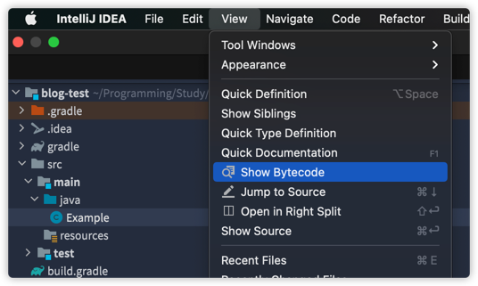
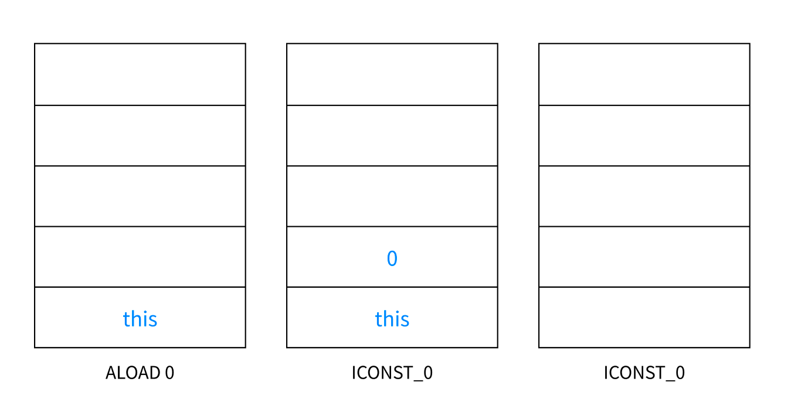
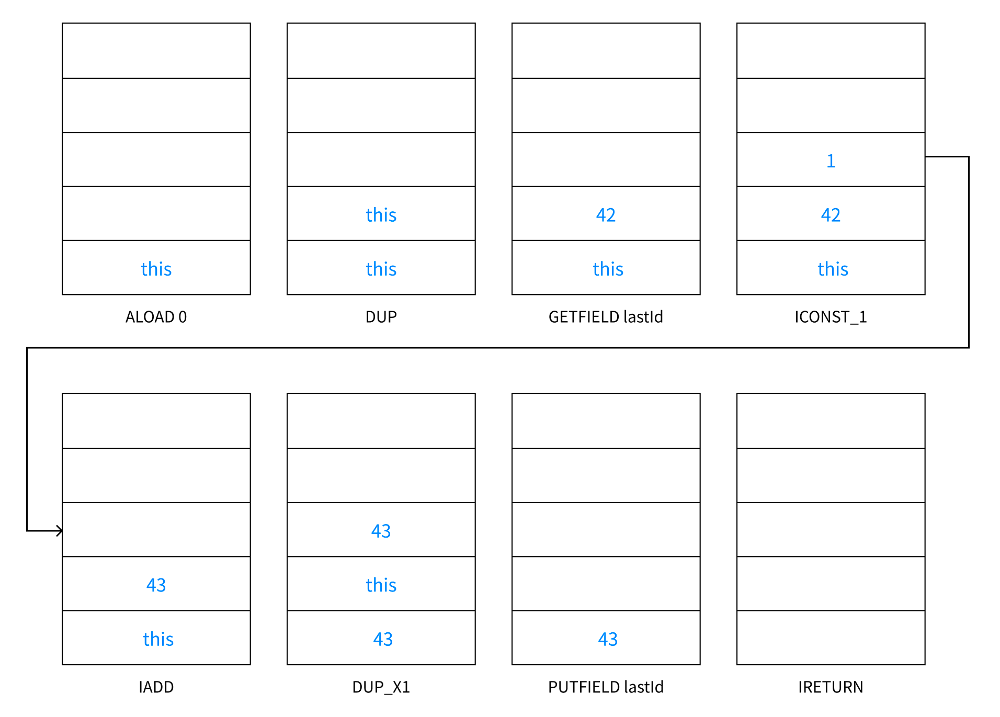

## 가상 머신(VM)

가상 머신(VM : Virtual Machine)은 물리적인 CPU에 의해 처리되는 동작을 흉내낼 수 있어야 한다. 따라서 일반적으로 VM은 아래의 개념들을 구현(포함)해야 한다.

* 소스 코드를 VM이 실행할 수 있는 바이트 코드로 변환
* 명령어와 피연산자를 포함하는 데이터구조
* 함수를 실행하기 위한 콜스택
* 다음 실행할 명령어를 가리키는 IP(Instruction Pointer)
* 가상 CPU
  * Fetch
    * IP가 가리키는 명령어를 가져온다
  * Decode
    * 가져온 명령어를 디코드(해석)한다.
  * Execution
    * 디코딩된 명령어를 수행한다

일반적으로 위 개념을 구현하는 방법은 크게 2가지가 존재한다.

* 스택 기반의 VM
* 레지스터 기반의 VM

두 방법은 피연산자를 저장하고 다시 가져오는 메커니즘이 다르다. JVM이 바로 스택 기반의 VM이다


## 스택 기반의 VM


JVM과 Net CLR이 스택 기반의 VM이다.

예를 들어 `13 + 20 + 7` 을 계산한다고 하자. CPU의 덧셈 연산은 2개의 피연산자를 다루므로 `20 + 7` 를 계산한 결과를 `13` 과 더해야만 한다. 스택 기반의 VM은 이 결과를 바로 스택에 저장한다.

위 그림을 보면, 20과 7을 더하기 위해서 두 피연산자를 스택에서 꺼낸다. 꺼낸 결과를 가지고 계산한 뒤에 다시 결과를 스택에 넣는 것을 알 수 있다.

### Java의 Byte code와 Stack VM
실제로 Java 코드를 byte 코드로 변환해서 Java가 Stack 기반의 JVM을 어떻게 활용하는지 살펴보자.

우선, 바이트 코드를 살펴보기 전에 **프레임**, **지역 변수**, **피연산자 스택**을 먼저 정의내리고 시작하자.

* 프레임(Frame)이란 반환 주소, 메서드로 넘어온 매개변수, 메서드가 정의하는 지역 변수를 포함한다. 모든 메서드 호출에는 프레임이 필요하다.
* 지역변수(Local variable)란 메서드 범위 내에 정의되는 모든 변수를 가리킨다. 정적 메서드를 제외한 모든 메서드는 `this`라는 지역 변수를 갖는다. `this`는 현재 객체를 의미한다.
* 피연산자 스택(Operand stack)이란 LIFO 자료 구조다. JVM이 지원하는 대부분의 명령어는 매개변수를 받는데, 이 매개변수를 저장한다. 즉, 스택 기반의 VM에서 활용되는 스택이 바로 피연산자 스택이다.

자 그럼 다음과 같은 클래스가 있다고 생각해보자.

```java
public class Test{
    int lastId;

    public void resetId() {
        lastId = 0;
    }

    public int getNextId() {
        return ++lastId;
    }
}
```



**IntelliJ**를 사용한다면 View - Show Bytecode를 통해 Byte code를 확인할 수 있다. 

또는 아래 명령어를 통해서 확인할 수도 있다.

```shell
// 우선 컴파일한다
javac Example.java
// Byte Code를 확인한다
javap -v -p -s Example.class
// 리다이렉션(>)를 사용해 파일에 저장할 수도 있다
javap -v -p -s Example.class > Example.txt
```

이 코드의 Byte Code는 아래와 같다.
```java
// class version 55.0 (55)
// access flags 0x21
public class Example {

  // compiled from: Example.java

  // access flags 0x0
  I lastId

  // access flags 0x1
  public <init>()V
   L0
    LINENUMBER 1 L0
    ALOAD 0
    INVOKESPECIAL java/lang/Object.<init> ()V
    RETURN
   L1
    LOCALVARIABLE this LExample; L0 L1 0
    MAXSTACK = 1
    MAXLOCALS = 1

  // access flags 0x1
  public resetId()V
   L0
    LINENUMBER 5 L0
    ALOAD 0
    ICONST_0
    PUTFIELD Example.lastId : I
   L1
    LINENUMBER 6 L1
    RETURN
   L2
    LOCALVARIABLE this LExample; L0 L2 0
    MAXSTACK = 2
    MAXLOCALS = 1

  // access flags 0x1
  public getNextId()I
   L0
    LINENUMBER 9 L0
    ALOAD 0
    DUP
    GETFIELD Example.lastId : I
    ICONST_1
    IADD
    DUP_X1
    PUTFIELD Example.lastId : I
    IRETURN
   L1
    LOCALVARIABLE this LExample; L0 L1 0
    MAXSTACK = 3
    MAXLOCALS = 1
}

```

우선, 간단한 메서드인 `resetId()`부터 확인해보자.
```java
 public resetId()V
    ALOAD 0
    ICONST_0
    PUTFIELD Example.lastId : I
    RETURN
```
우리가 다루지 않을 부분은 생략했다. 스택 위주로 살펴보자.


* `ALOAD 0`
  * 0번째 변수를 피연산자 스택에 넣는다. 0번째 메소드는 바로 `this`다. 메소드가 호출되면 프레임이 생성되면서 메시지를 받은 객체(Example의 인스턴스)가 프레임에 저장된다. `this`는 모든 인스턴스 메서드 프레임에 가장 먼저 저장되는 변수다.
* `ICONST_0`
  * 피연산자 스택에 상수값 `0`을 넣는다.
* `PUTFIELD lastId`
  * 스택 첫째 값(`0`)을 스택 둘째 값(`this`)이 가리키는 객체의 `lastId` 필드에 저장한다.
* `RETURN`
  * 함수를 종료한다. `resetId()`의 경우 반환하는 값이 없다.

단순히 어떤 변수에 0을 저장하는 연산에도 스택에 값을 넣고, 스택에 있는 값을 변수에 저장하는 등 모든 연산에 스택을 활용하는 것을 알 수 있다. 
조금 더 복잡한 예를 살펴보자.

```java
  public getNextId()I
    ALOAD 0
    DUP
    GETFIELD Example.lastId : I
    ICONST_1
    IADD
    DUP_X1
    PUTFIELD Example.lastId : I
    IRETURN
```


* `ALOAD 0`
  * 0번째 변수를 피연산자 스택에 넣는다. 즉, `this`를 피연산자 스택에 넣는다.
* `DUP`
  * 스택 첫째 값(`this`)을 복사한다. 이제 피연산자 스택에는 `this`가 2개 존재한다. 
* `GETFIELD Example.lastId`
  * 스택 첫째 값(`this`)의 `lastId` 필드에서 값을 가져와서 스택에 넣는다.
* `ICONST_1`
  * 스택에 정수 상수 `1`을 넣는다.
* `IADD`
  * 스택 첫째 값(`1`)을 스택 둘쨰 값(`42`)`에 더하고 그 결과(`43`)을 스택에 넣는다.
* `DUP_X1`
  * 스택 첫째 값(`43`)을 복사해 `top`보다 2단계 아래 있는 곳에 넣는다. 즉, `this` 아래에 `42`를 복사해서 넣는다.
* `PUTFIELD Example.lastId`
  * 스택 첫째 값(`43`)을 스택 둘째 값(`this`)이 가리키는 현재 객체의 `lastId` 필드에 저장한다.
* `IRETURN`
  * 스택 첫째 값이자 유일한 값(`43`)을 반환한다.

위에서 살펴본 것처럼 값을 가져오고, 계산하고, 저장하고, 반환하는 과정에서 스택을 활용하는 것을 알 수 있다. 그 덕분에 명령어들은 매우 간단하지만 **간단한 코드**를 수행하기 위해 꽤나 많은 Byte Code가 필요한 것을 알 수 있다.

즉, 스택 기반의 VM은 피연산자를 저장하고 가져올 때 스택을 활용한다. 스택 기반의 VM의 장단점은 아래와 같다.

* 장점
  * 하드웨어에 덜 의존적이다
    * 하드웨어(레지스터, CPU)에 대해 직접적으로 다루지 않으므로 다양한 하드웨어에서 쉽게 VM을 구현할 수 있다
  * 명령어의 길이가 짧아진다
    * 다음 피연산자는 스택의 TOP에 존재하므로 피연산자의 메모리 주소를 사용할 필요가 없다. 따라서 명령어에 메모리 주소를 적을 필요가 없으므로 명령어의 길이가 짧아진다
* 단점
  * 명령어의 수가 많아진다
  * 스택을 사용하는 오버헤드가 존재한다
  * 명령어 최적화를 할 수 없다

## 레지스터 기반의 VM


Lua VM, Dalvik VM이 바로 레지스터 기반의 VM이다.

예를 들어 `5 + 30 + 40` 을 계산한다고 하자. CPU의 덧셈 연산은 2개의 피연산자를 다루므로 `20 + 7` 를 계산한 결과를 `13` 과 더해야만 한다. 레지스터 기반의 VM은 피연산자를 레지스터에서 가져와서 계산하고, 결과를 다시 레지스터에 저장한다.

즉, 레지스터 기반의 VM은 피연산자를 레지스터에서 가져와서 계산한 뒤 다시 레지스터에 저장한다. 레지스터 기반의 VM의 장단점은 다음과 같다.

* 장점
  * 명령어의 수가 적다
    * POP, PUSH 없이 하나의 명령어로 계산할 수 있으므로 명령어의 수가 적어진다
  * 스택을 사용하지 않아 스택에 대한 오버헤드가 없다
  * 스택 기반에서는 할 수 없는 명령어 최적화를 할 수 있다
    * 코드에 동일한 연산식이 존재하는 경우 처음 계산한 결과를 레지스터에 넣어서 여러번 쓸 수 있다. 따라서 식 계산에 들어가는 비용을 최적화할 수 있다
* 단점
  * 명령어의 크기가 커진다
    * 명령어에 피연산자의 메모리 주소를 명시해야 하므로 명령어의 길이가 길어진다


## 스택 기반 VM vs 레지스터 기반 VM

[논문](https://www.usenix.org/legacy/events/vee05/full_papers/p153-yunhe.pdf)에 따르면 레지스터 기반의 VM이 스택 기반 VM 보다 명령어 수는 47% 적지만 명령어 사이즈는 25% 크다고 한다.

또한 더 많은 VM 명령어를 가져옴으로써 실제 컴퓨터 부하를 명령어 당 1.07% 줄일 수 있다고 한다.

하지만, VM 명령어 디스패치가 실제 컴퓨터 부하보다 훨씬 비싸다는 점을 생각하면 코드 사이즈를 조금 늘리더라도 명령어 수를 줄이는 것이 훨씬 효율적이라고 한다

실제로 벤치마크를 돌렸을 때 레지스터 기반 VM이 스택 기반 VM 보다 32.3%만큼 줄어든 시간이 걸린다고 한다.

## JVM

그럼에도 불구하고 Java가 스택 기반의 VM을 사용하는 이유는 스택 기반의 VM은 레지스터 기반의 VM보다 하드웨어(레지스터, CPU)에 적게 의존하기 때문이다. 레지스터 기반 VM은 연산 결과를 CPU의 레지스터에 저장하므로 구현이예를 들면 레지스터의 개수, 레지스터의 사이즈 등에 의존할 수 밖에 없다.

하지만 스택 기반 VM은 스택 포인터를 사용해 상대적으로 하드웨어에 독립적인 구현을 할 수 있고 따라서 VM을 다양한 하드웨어에서 구현하기 쉽다.

OS와 상관없이 JAVA 프로그램을 실행하기 위해서는 여러 OS, 하드웨어 위에서 돌아가는 JVM을 구현해야 했기 때문에 스택 기반의 VM이 최적이었을 것이다.

```toc
```
