## Node.js Event Loop

흔히 `Node.js`를 **싱글 스레드 논 블로킹**이라고 한다. `Node.js`는 **하나의 스레드**로 동작하지만 I/O 작업이 발생한 경우 이를 **비동기적**으로 처리할 수 있다. 
분명 하나의 스레드는 하나의 실행 흐름만을 가지고 있고 **파일 읽기**와 같이 **기다려야 하는 작업**을 실행하면 그 작업이 끝나기 전에는 아무것도 할 수 없어야만 한다. 
그러나 `Node.js`는 하나의 스레드만으로 여러 **비동기 작업**들을 블로킹 없이 수행할 수 있고 그 기반에는 **이벤트 루프**가 존재한다.

## Node.js의 구조
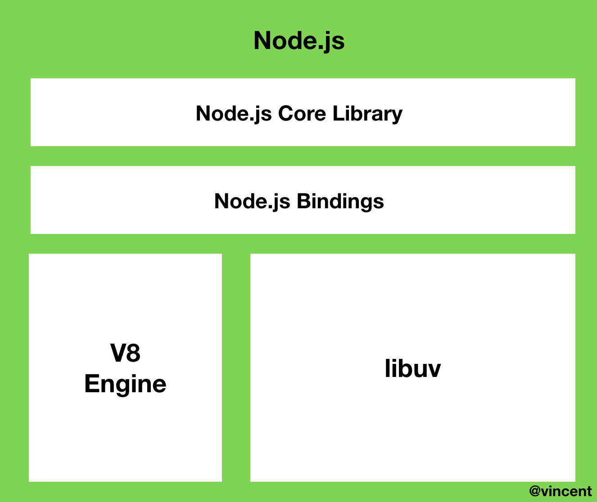
**이벤트 루프**를 이해하기 위해서 `Node.js`가 어떻게 구성되어 있는지를 알아야 한다. 
`Node.js`는 `C++`로 작성된 런타임이고 그 내부에 `V8 Engine`를 가지고 있다. 그 덕분에 크롬과 같은 브라우저에서 실행하던 자바스크립트를 로컬에서 실행할 수 있다. 
그런데 그 내부에는 `V8 Engine` 말고도 `libuv `라는 라이브러리가 존재한다.
### libuv

`libUV`란 `C++`로 작성된, `Node.js`가 사용하는 **비동기 I/O** 라이브러리다. 이는 사실 운영체제의 **커널**을 추상화한 Wrapping 라이브러리로 **커널**이 **어떤 비동기 API**를 지원하는지 알고있다. 

다시 말해 우리가 `libuv `에게 파일 읽기와 같은 **비동기 작업**을 요청하면 `libuv`는 이 작업을 커널이 지원하는지 확인한다. 만약 지원한다면 `libuv`가 대신 **커널**에게 **비동기적**으로 요청했다가 응답이 오면 그 응답을 우리에게 전달해준다. 
만약 요청한 작업을 **커널**이 지원하지 않는다면 어떻게 할까? 바로 자신만의 **워커 스레드**가 담긴 스레드 풀을 사용한다.

> 실제로 `node`를 실행하면 그 아래의 여러 개의 `node` 스레드가 존재하는 것을 확인할 수 있다.  

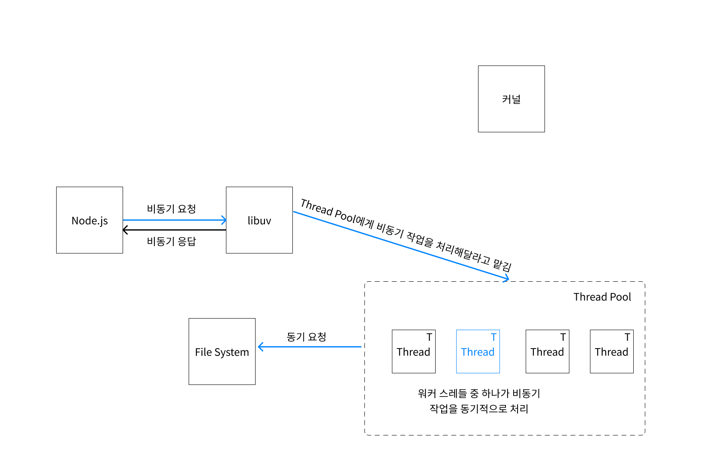

`libuv`는 기본적으로 4개의 스레드를 가지는 **스레드 풀**을 생성한다. 물론 `uv_threadpool`라는 환경 변수를 설정해 **최대 128개**까지 스레드 개수를 늘릴 수도 있다. 만약 우리가 요청한 작업을 **커널**이 지원하지 않는다면 `libuv`는 커널을 호출하는 대신 이 스레드 풀에게 작업을 맡겨버린다. 

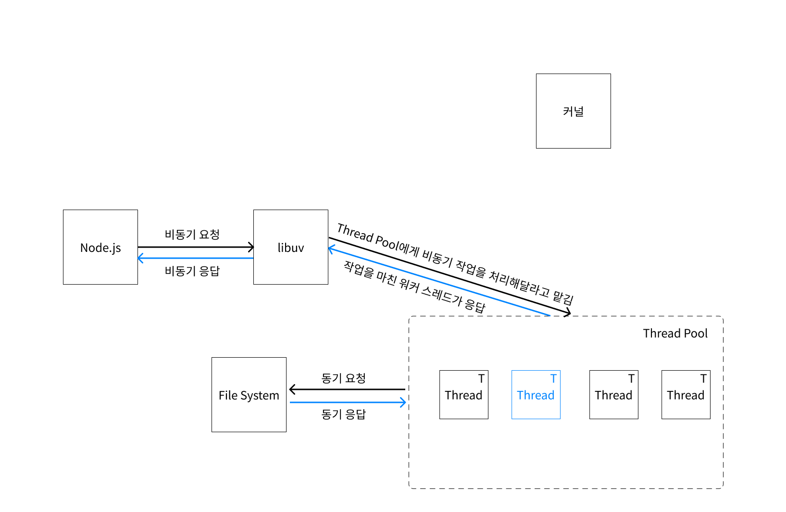
그리고 스레드 풀에 있던 스레드가 작업을 완료하면 `libuv`가 우리에게 요청한 작업이 완료되었다고 친절하게 알려준다.

즉, 정리하면 다음과 같다.
* `libuv`는 운영체제의 **커널**을 추상화해서 비동기 API를 지원한다.
* `libuv`는 커널이 어떤 **비동기 API**를 지원하고 있는지 알고 있다.
* 만약 커널이 지원하는 비동기 작업을 `libuv`에게 요청하면 `libuv`는 대신 커널에게 이 작업을 **비동기적**으로 요청해준다.
* 만약 커널이 지원하지 않는 비동기 작업을 `libuv`에게 요청하면 `livuv`는 내부에 가지고있는 **스레드 풀**에게 이 작업을 요청해준다.
### 그래서 `libuv`가 뭔데?
지금까지 `libuv`라는 비동기 I/O 라이브러리가 존재하고 `Node.js`가 이를 내부적으로 이용한다는 사실을 살펴봤다. 
그렇다면 도대체 `libuv`와 **이벤트 루프**는 어떠한 관계가 있고 그래서 `Node.js`는 어떻게 싱글 스레드로 **논블로킹 비동기** 작업을 지원하는걸까?

`Node.js`는 **I/O 작업**을 자신의 **메인 스레드**가 아닌 **다른 스레드**에 위임함으로써 싱글 스레드로 **논 블로킹 I/O**를 지원한다. 
다르게 말하면 `Node.js`는 **I/O 작업**을 `libuv`에게 위임함으로써 **논 블로킹 I/O**를 지원하고 그 기반에는 **이벤트 루프**가 있다.
## Nods.js 속 이벤트 루프

**이벤트 루프**는 `Node.js`가 여러 **비동기 작업**을 관리하기 위한 구현체다. `console.log("Hello World")`와 같은 동기 작업이 아니라 `file.readFile('test.txt', callback)`과 같은 **비동기 작업**들을 모아서 관리하고 순서대로 실행할 수 있게 해주는 도구이며 위와 같이 구성되어있다.

우선 점선으로 된 `nextTickQueue`와 `microTaskQueue`는 **이벤트 루프**의 일부가 아니다. 따라서 아래에서 설명하는 내용에 해당되지 않는다. 비록 이벤트 루프를 구성하지는 않지만 `Node.js`의 비동기 작업 관리를 도와주는 것들로 아래에서 더 자세하게 다룬다.

각 **박스**는 특정 작업을 수행하기 위한 **페이즈(Phase)**를 의미한다.그리고 `Node.js`의 이벤트 루프는 
* `Timer Phase`
* `Pending Callbacks Phase`
* `Idle, Prepare Phase`
* `Poll Phase`
* `Check Phase`
* `Close Callbacks Phase`

로 구성되어있다. 

페이즈 전환 순서 또한 그림에 나타난 것처럼  `Timer Phase` -> `Pending Callbacks Phase` -> `Idle, Prepare Phase` -> `Poll Phase` -> `Check Phase` -> `Close Callbacks Phase` -> `Timer Phase` 순을 따른다. 이렇게 **한 페이즈**에서 **다음 페이즈**로 넘어가는 것을 **틱(Tick)**이라고 부른다.

각 **페이즈**는 자신만의 **큐**를 **하나**씩 가지고 있는데, 이 큐에는 **이벤트 루프**가 실행해야 하는 작업들이 순서대로 담겨있다. `Node.js`가 **페이즈**에 진입을 하면 이 큐에서 자바스크립트 코드(예를 들면 콜백)를 꺼내서 하나씩 실행한다. 만약 큐에 있는 작업들을 다 실행하거나, **시스템의 실행 한도**에 다다르면 `Node.js`는 **다음 페이즈**로 넘어간다. 

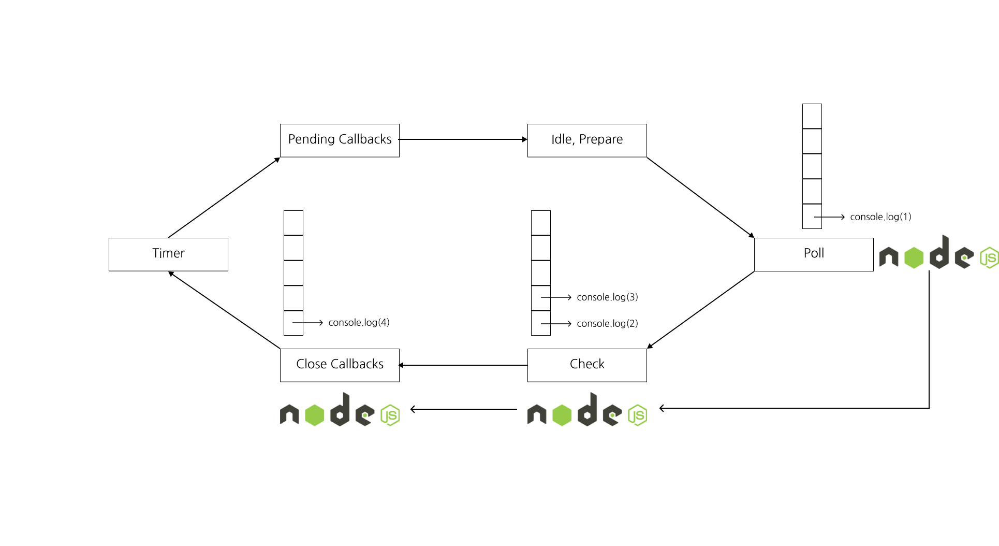

따라서 위 그림처럼 `Poll`, `Check`, `Close` 페이즈가 관리하는 큐에 `console.log` 콜백이 쌓여있고 `Node.js`가 `Poll Phase`부터 `Check Phase`, `Close Callbacks Phase` 순으로 차례대로 실행한다. 즉, 출력 결과는 아래와 같다.
```js
1
2
3
4
```
이때 **이벤트 루프**가 `Node.js`의 비동기 실행을 도와주는 것과 별개로 **싱글 스레드**이므로 한번에 하나의 페이즈에만 진입해 한번에 하나의 작업만 수행할 수 있다는 점을 명심해야 한다. `Poll Phase` 작업을 처리하면서 `Check Phase`의 작업을 동시에 처리하거나 `Poll Phase`의 작업을 한번에 여러 개씩 처리하는 것은 불가능하다.

정리하면 아래와 같다.

* 이벤트 루프는 `Node.js`가 비동기 작업을 관리하기 위한 구현체다.
* 이벤트 루프는 총 6개의 페이즈로 구성되어 있으며 한 페이즈에서 다음 페이즈로 넘어가는 것을 틱이라고 한다.
* 각 페이즈는 자신만의 큐를 관리한다.
* `Node.js`는 순서대로 페이즈를 방문하면서 큐에 쌓인 작업을 **하나씩** 실행한다.
* 페이즈의 큐에 담긴 작업을 모두 실행하거나 **시스템의 실행 한도**에 다다르면 `Node.js`는 다음 페이즈로 넘어간다.
* 이벤트 루프가 살아있는 한 `Node.js`는 이벤트 루프를 반복한다.

> 실제로 `Node.js`의 이벤트 루프 코드를 보면 반복문 속에서 차례대로 페이즈를 수행하는 것을 볼 수 있다.  
```c
int uv_run(uv_loop_t* loop, uv_run_mode mode) {
	// ...
  while (r != 0 && loop->stop_flag == 0) {
    uv__update_time(loop);
    uv__run_timers(loop);
    ran_pending = uv__run_pending(loop);
    uv__run_idle(loop);
    uv__run_prepare(loop);
    // ...
    uv__io_poll(loop, timeout);
	  // ...
    uv__run_check(loop);
    uv__run_closing_handles(loop);
	  // ...
    r = uv__loop_alive(loop);
    if (mode == UV_RUN_ONCE || mode == UV_RUN_NOWAIT)
      break;
  }
  return r;
}
```

여기서 주의해야 하는 점은 큐에 **3개**의 작업이 담겨있었다고 항상 **3개의 작업**만 처리하고 **다음 페이즈**로 넘어가는 것은 아니라는 거다. 다음과 같은 데이터베이스 호출 코드가 있다고 해보자.
```js
db.query("SELECT * FROM EVENT_LOOP", (err, data) => {
		console.log(data);
});
```
`SELECT * FROM EVENT_LOOP`라는 쿼리를 날렸다면 **언젠간** 데이터베이스는 쿼리 결과를 응답해 줄거고 우리는 그 결과를 **콜백**을 통해 받아볼 수 있다. 위 코드의 경우 그 **콜백
**은 쿼리 결과를 출력하는 함수가 된다.

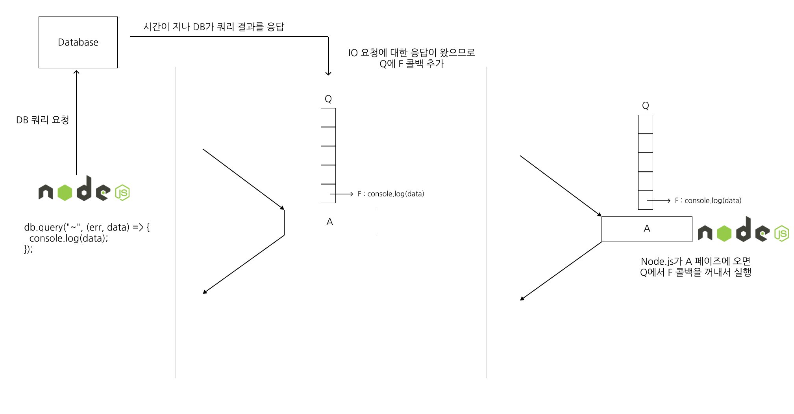

앞에서 말했듯이 **이벤트 루프**는 **비동기 작업**들을 관리한다. 위에서 말한 콜백 또한 하나의 **비동기 작업**이므로 어떤 **페이즈**가 관리하는 **큐**에 담겨있다. 그 페이즈를 `A`, 그 큐를 `Q`, 그리고 위 콜백을 `F`라고 했을 때 `A`가 관리하는 큐 `Q`에는 `F`가 하나 담겨있다. 그리고 `Q`에는 오직 `F` 작업 하나만 담겨있다고 해보자.
* `Node.js`가 열심히 **이벤트 루프**를 돌다가 `A` 페이즈에 진입한다
* `Node.js`는 `Q`를 확인한다
* `Q`에서 `F`를 꺼내서 실행한다
* `Node.js`는 `Q`를 확인한다. 
* 큐가 비어있으니 `Node.js`는 다음 페이즈로 넘어간다

위 케이스에서는 **큐**에 **1개**의 작업만 있었고 `Node.js`는 **1개**의 작업만 실행하고 다음 페이즈로 넘어갔다. 그러나 항상  `Node.js`가 페이즈에 진입할 시점에 큐에 담겨있던 작업들만 실행하고 다음 페이즈로 넘어가는 것은 아니다. 만약 위 코드가 아래 코드처럼 변한다면 어떻게 될까?
```js
db.query("SELECT * FROM EVENT_LOOP", (err, data) => {
		db.query("SELECT * FROM SPRING_BOOT", (err2, data2) => {
				console.log("Hello World~");
		});
		console.log(data);
});
```
이번에는 `SELECT * FROM EVENT_LOOP`라는 쿼리만 날리는 것이 아니라 이 쿼리의 응답이 왔을 때 `SELECT * FROM SPRING_BOOT`라는 새로운 쿼리를 날린다. 처음 실행되는 콜백을 `F1`이라고 하고 두 번째 콜백을 `F2`라고 해보자. 이해하기 쉽게 바꾸면 아래와 같이 된다.
```js
const F2 = (err, data) = {
		console.log("Hello World~");
}
const F1 = (err, data) => {
		db.query("SELECT * FROM SPRING_BOOT", F2);
		console.log(data);
}
db.query("SELECT * FROM EVENT_LOOP", F1);
```
자 아까 봤던 예제와 똑같이 페이즈 `A`가 있었고 이 페이즈는 큐 `Q`를 관리한다. 그리고 그 큐에는 `F1` 작업 하나가 담겨있다.
 * `Node.js`가 열심히 **이벤트 루프**를 돌다가 `A` 페이즈에 진입한다
*  `Node.js`는 `Q`를 확인한다. 
* `Q`에서 `F1`를 꺼내서 실행한다.
    * `SELECT * FROM SPRING_BOOT`라는 새로운 쿼리를 날린다
    * 콘솔에 `SELECT * FROM EVENT_LOOP` 결과를 출력한다.

중간에 쿼리를 하나 더 실행한다는 점만 빼면 아까와 다른 점이 없다. 만약 콘솔에 `SELECT * FROM EVENT_LOOP`의 결과를 출력하던 중 `SELECT * FROM SPRING_BOOT` 쿼리의 응답이 온다면 어떻게 될까? 마침 이 쿼리의 콜백을 다루는 페이즈가 `A`였다면 이 쿼리의 콜백 즉, `F2`는 `Q`로 들어가게 된다. 그러면 아래와 같은 일이 벌어질 수 있다.


* `Node.js`가 열심히 **이벤트 루프**를 돌다가 `A` 페이즈에 진입한다
* `Node.js`는 `Q`를 확인한다. 
* `Q`에서 `F1`를 꺼내서 실행한다.
    * `SELECT * FROM SPRING_BOOT`라는 새로운 쿼리를 날린다

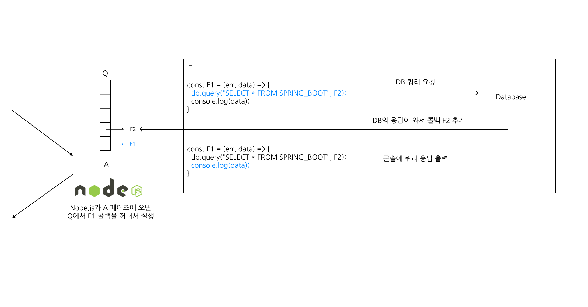)
* `Q`에서 `F1`를 꺼내서 실행한다.
    * 콘솔에 쿼리 결과를 출력하기 전에 `SELECT * FROM SPRING_BOOT`의 응답이 와서 `F2` 콜백을 `Q`에 추가한다
    * 콘솔에 `SELECT * FROM EVENT_LOOP` 결과를 출력한다.

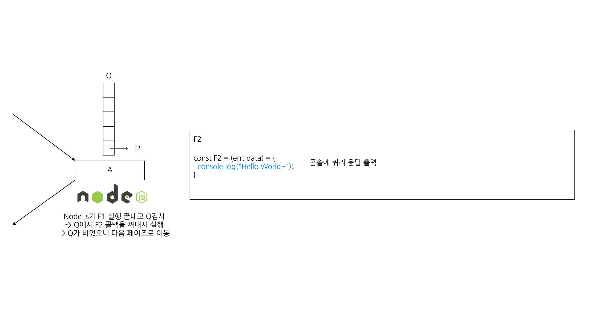

* `Node.js`는 `Q`를 확인한다.
* `Q`에서 `F2`를 꺼내서 실행한다.
    * 콘솔에 `Hello World~`를 출력한다.
* `Node.js`는 `Q`를 확인한다.
* 큐가 비어있으니 `Node.js`는 다음 페이즈로 넘어간다

이 예제에서는 처음 예제와는 다르게 `Node.js`가 페이즈 `A`에 진입할 때는 큐에 1개의 작업만 있었지만 실제로 2개의 작업을 수행하고 다음 페이즈로 넘어갔다. 큐에서 작업을 꺼내 하나하나씩 실행하다보면 큐에 새로운 작업이 들어올 수 있다. 위에서 보인 예제처럼 I/O에 대한 콜백이 될 수도 있고, 커널이 새로운 작업을 스케줄링 해줄 수도 있다. 같은 페이즈 `A`에서 실행한 작업의 콜백이 `A`의 큐로 들어갈 수도 있고 이전 페이즈인 `B`에서 예전에 실행했던 작업의 콜백이 `A`의 큐로 들어갈 수도 있다.

여기서 핵심은 각 페이즈에서 실행한 작업이 또 다른 작업을 스케줄링 하거나, 이전에 처리했던 작업의 이벤트가 커널에 의해 큐에 추가될 수 있다는 것이다. 극단적으로는 큐에 **한 개**의 작업밖에 없었지만 `Node.js`는 그 큐에 계속 추가되는 작업들을 처리하느라 다른 페이즈로 이동하지 못할 수도 있다. 하지만 **페이즈**는 **시스템의 실행 한도**의 영향을 받기 때문에 쌓인 작업을 처리하다가 포기하고 다음 페이즈로 넘어간다. `Node.js`가 한 페이즈에 영원히 갇히는 일은 발생하지 않는다.

> 페이즈가 아닌 `nextTickQueue`의 경우 **시스템의 실행 한도**의 영향을 받지 않기 때문에 `Node.js`가 영원히 갇혀 다음 페이즈로 이동하지 못할 수 있다.  

정리하면 아래와 같다.

* `Node.js`는 페이즈에 진입해 큐에 쌓인 작업을 처리한다
* 쌓인 작업을 처리하던 중 이전 페이즈에서 실행했던 작업의 콜백이나 커널이 스케줄링한 새로운 작업이 큐에 추가될 수 있다.
* `Node.js`가 큐에 계속 추가되는 작업을 처리하느라 다음 페이즈로 넘어가지 못할 수 있다. 단, **페이즈**는 **시스템의 실행 한도**의 영향을 받으므로 `Node.js`가 한 페이즈에 영원히 갇히는 일은 없다.

## Node 실행과 이벤트 루프 흐름
지금까지 **이벤트 루프**를 구성하는 **페이즈**와 **큐**는 무엇인지, `Node.js`가 여러 페이즈를 돌아다니면서 무슨 일을 하는지 간단하게 알아봤다. 
각 **페이즈**는 자신들이 **관심있어 하는 작업**들만 자신의 큐에서 관리한다. 예를 들어 `Timer Phase`는 이름 그대로 **타이머**에 관한 비동기 작업들을 관리한다. 
`Close Callback Phase`는 `Close Callback`과 관련된 비동기 작업들만 관리한다.

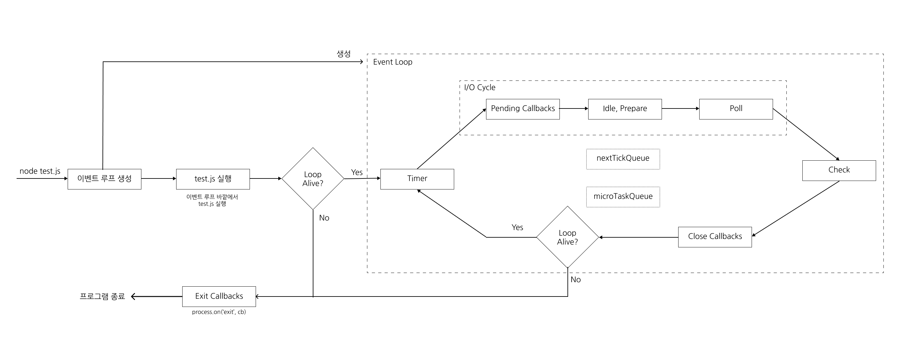

각 페이즈를 하나하나 살펴보기 전에 우리가 실제로 `node someScript.js`를 실행했을 때 어떤 일이 벌어지는지, 코드 실행과 **이벤트 루프**는 어떤 관련이 있는지부터 알아보자.

우리가 `node someScript.js`를 실행하면 `Node.js`는 우선 **이벤트 루프**를 만든다. 그리고 **이벤트 루프 바깥**에서 `someScript.js`를 실행한다. 처음부터 끝까지 `someScript`를 실행하고 나면 `Node.js`는 그제서야 **이벤트 루프**를 확인한다. 만약 **이벤트 루프**에 남은 작업이 있다면 `Node.js`는 **이벤트 루프**에 진입해 반복하며 작업을 실행한다. **이벤트 루프**에 남은 작업이 없다면 `Node.js`는 `process.on('exit', callback)`을 실행하고 이벤트 루프를 종료한다.

말로는 잘 이해가 되지 않으니 코드를 보면서 다시 이해해보자.

```javascript
// test.js
console.log("Hello Wrold");
```

`node test.js`를 실행하면 `Node.js`는 우선 **이벤트 루프**를 생성한다.
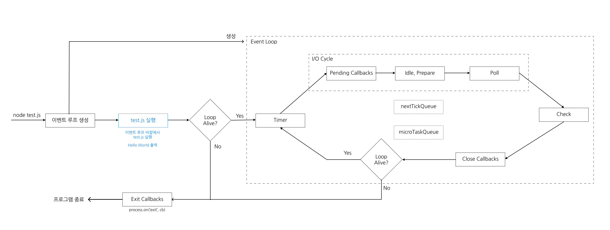
생성한 **이벤트 루프**에 진입하지 않고 **이벤트 루프 바깥**에서 `test.js`를 처음부터 끝까지 차례대로 실행한다. 다시 말해 이벤트 루프를 만들어 놓고 `Timer Phase`에 진입하기 전에 `test.js`를 처음부터 끝까지 실행한다. 위 코드에서는 `Hello World`라는 문자열이 출력된다.

`test.js`를 처음부터 끝까지 실행했으므로 **이벤트 루프**가 살아있는지 확인한다. 다시 말해 **이벤트 루프**에 남아있는 작업이 있는지 확인한다. `test.js`의 경우 그 어떤 비동기 호출도 하지 않았으므로 **이벤트 루프**에는 남아있는 작업이 없다. 
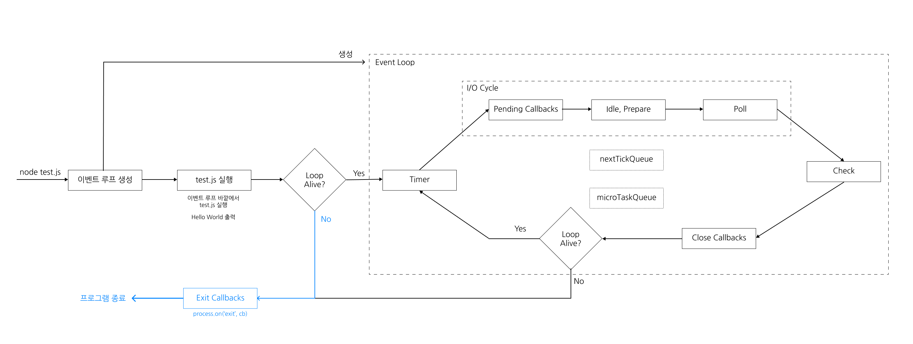
따라서 `process.on('exit')`의 콜백을 실행하고 이벤트 루프를 종료한 뒤에 프로그램을 종료한다.
반대로 비동기 작업이 있는 코드를 생각해보자.
```javascript
// test.js
setTimeout(() => console.log("Async Hello World"), 1000);
console.log("Hello World");
```
위 코드에는 `setTimeout`이라는 비동기 작업이 추가되었다. 뒤에서 더 자세하게 이야기하지만 `setTImeout`의 비동기 작업은 `Timer Phase`가 관리한다.
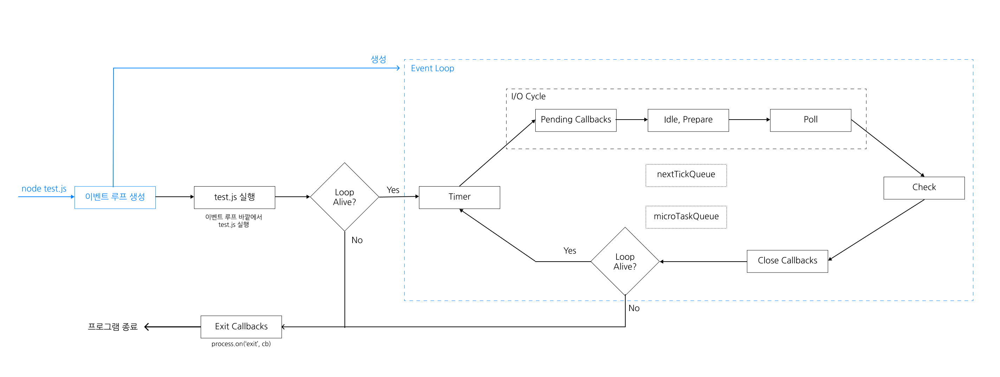
`node test.js`를 실행하면 `Node.js`는 우선 **이벤트 루프**를 생성한다.

생성한 **이벤트 루프**에 진입하지 않고 **이벤트 루프 바깥**에서 `test.js`를 처음부터 끝까지 차례대로 실행한다. 다시 말해 이벤트 루프를 만들어 놓고 `Timer Phase`에 진입하기 전에 `test.js`를 처음부터 끝까지 실행한다. 우선 `setTimeout`이 호출되면서 `Timer Phase`에 `Async Hello World`라는 문자열을 1초 뒤에 출력하는 콜백을 `Timer Phase`에 등록한다. 그리고 `Hello World`라는 문자열을 출력한다.

`test.js`를 처음부터 끝까지 실행했으므로 **이벤트 루프**가 살아있는지 확인한다. 다시 말해 **이벤트 루프**에 남아있는 작업이 있는지 확인한다. `test.js`의 경우 `setTimeout`으로 `Timer Phase`에 등록한 작업이 있으므로 **이벤트 루프**에 진입한다.
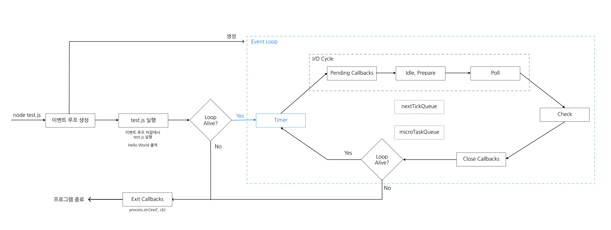
먼저 **이벤트 루프**의 `Timer Phase`에 진입한다. `Node.js`는 `Timer Phase`가 관리하는 **타이머**들을 살펴보면서 **실행할 준비**가 되었는지 확인한다. 우리는 1초 뒤에 `Async Hello World`라는 문자열을 출력하기로 했으므로 아직 실행할 준비가 안 되었다고 하자. 실행할 수 있는 작업이 없으므로 `Node.js`는 다음 페이즈로 이동한다.

`Node.js`는 `Timer Phase`를 지나 `Pending Callbacks Phase`, `Idle, Prepare Phase`, `Poll Phase`, `Check Phase`, `Close Callbacks Phase`를 차례대로 방문한다. 이 페이즈들에서도 실행할 수 있는 작업이 없으므로 `Node.js`는 `Loop Alive`까지 아무런 작업 없이 도달한다.
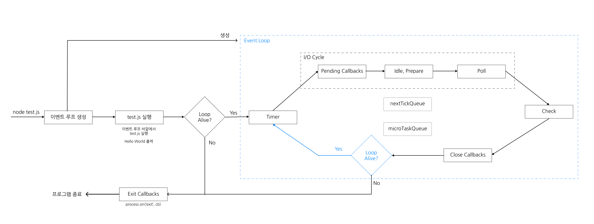
다시 한 번 **이벤트 루프**가 살아있는지 확인한다. 1초가 지나지 않아 **실행할 수 있는 작업**은 없지만 **아직 실행하지 못한 작업**이 있으므로 이벤트 루프는 살아있다. 따라서 다시 `Timer Phase`로 진입한다.
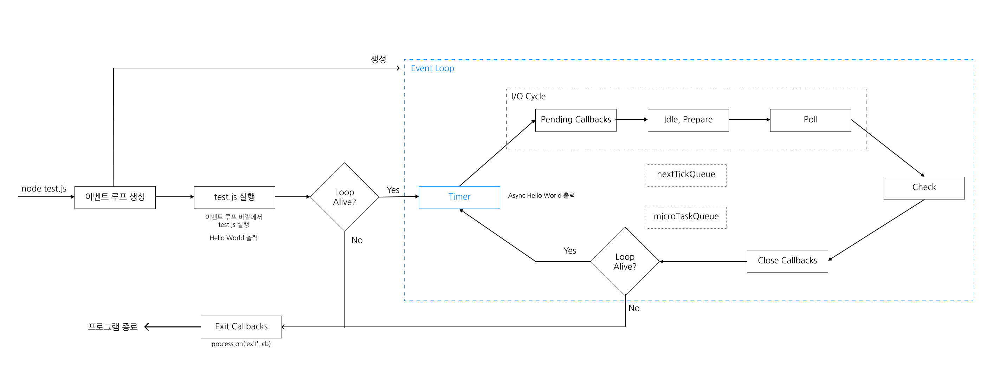
`Node.js`가 이벤트 루프를 열심히 돌다가 1초가 지나 이전에 `setTimeout`으로 등록해뒀던 콜백이 이제 실행할 준비가 되었다. `Node.js`는 `Timer Phase`가 관리하는 큐에서 콜백을 꺼내서 실행한다. 그 결과로 `Async Hello World`가 출력된다. `Timer Phase`에는 더이상 남아있는 작업이 없으므로 다음 페이즈로 이동한다.
> 실제로 위와 같은 상황에서 `Node.js`는 1초가 지날 때까지 이벤트 루프를 무한 반복 하지 않는다. 실제로는 `Poll Phase`에서 **이벤트 루프**를 반복해도 실행할 수 있는 작업이 없는 것을 인지하고 1초가 지나 `setTimeout` 콜백을 실행할 수 있을 때까지 대기한다. 1초가 지나 타이머의 콜백을 실행할 수 있게 되면 그제서야 다음 페이즈로 이동한다. 자세한 내용은 `Poll Phase`에서 살펴보자

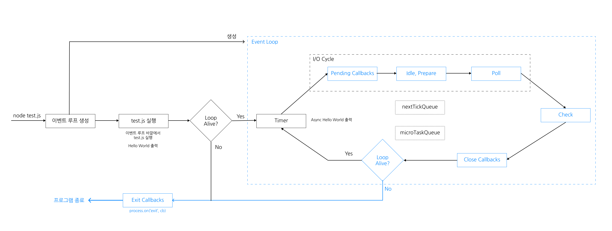

`Node.js`는 이벤트 루프의 페이즈들을 하나하나 방문한다. 물론 실행할 작업이 없기때문에 큐를 확인하고 바로 다음 페이즈로 넘어간다. 그러다가  `Loop Alive`에 도달하면 **이벤트 루프**가 살아있는지 확인한다. 이제는 **실행할 작업**이 하나도 없으므로  `process.on('exit')`의 콜백을 실행하고 이벤트 루프를 종료한 뒤에 프로그램을 종료한다.

이제 `Node.js`가 우선 **이벤트 루프**를 만들고 **이벤트 루프 바깥**에서 코드를 실행한다는 의미를 이해할 수 있을 것이다. **이벤트 루프 바깥**에서 어떤 일이 벌어지는지 확인했으니 이제 **이벤트 루프 안**에서 어떤 일이 벌어지는지 확인해보자. 지금까지의 내용을 정리하면 아래와 같다.

* `Node.js`는 코드를 실행하기 전에 우선 **이벤트 루프**를 생성한다.
* `Node.js`는 **이벤트 루프** 바깥에서 코드를 처음부터 끝까지 실행한다.
* **이벤트 루프**가 살아있는지 확인하고 진입하거나 `Exit Callbacks`을 실행하고 프로그램을 종료한다.
* **이벤트 루프**에 진입하면 페이즈를 차례대로 돌면서 **실행할 수 있는 작업**을 실행한다.
* 매 반복마다 **이벤트 루프**가 살아있는지 확인하고 죽었다면 `Exit Callbacks`을 실행하고 프로그램을 종료한다.

## 이벤트 루프의 여러 페이즈
**이벤트 루프**는 말했듯이 여러 **페이즈**로 구성되어있고 **페이즈**마다 관심있어 하는 작업들이 다 다르다. 즉, 비동기 작업의 종류마다 작업이 담기는 **페이즈**가 달라지며 그에 따라 실행 순서가 달라진다. 각 **페이즈**가 어떤 작업들을 다루는지, 어떻게 관리하는지 확인해보자.

### Timer Phase
`Timer Phase`는 말 그대로 `setTimeout`이나 `setInterval`과 같은 함수가 만들어 내는 타이머들을 다룬다. 엄밀하게 말하면 `Timer Phase`가 관리하는 큐에 콜백을 직접 담지는 않는다.

`Timer Phase`는 `setTimeout`이 호출되었을 때 타이머의 **콜백**을 큐에 저장하지 않는다. 그대신 콜백을 언제 실행할 지에 정보가 담긴 타이머를 `Timer Phase`가 관리하는 `min-heap`에 넣는다. 만약 `Poll Phase`에서 `setTimeout`를 3번 호출했다면 `Timer Phase`의 `min-heap`에 3개의 타이머가 저장되어있다. 그리고 타이머를 실행할 준비가 되면(시간이 되면) **타이머가 가리키고 있는 콜백**을 호출한다.

> 최소 힙(min heap)은 데이터를 완전 이진 트리 형태로 관리하면서 **최댓값** 또는 **최솟값**을 찾아내는데 효율적인 자료구조다. 최대 힙(max heap)은 최댓값을 찾아내는데 최적화 되어있고 최소 힙(min heap)은 최솟값을 찾아내는데 최적화 되어있다. 이러한 특성 덕분에 최소 힙을 사용하면 실행할 수 있는 가장 이른 타이머를 손쉽게 찾을 수 있다.  
> 더 자세한 설명은 [여기](https://www.section.io/engineering-education/understanding-min-heap-vs-max-heap/)를 참고하자.   

> 여러 블로그에서  `Timer Phase`는 타이머만 관리하고  `Poll Phase`에서 콜백이 실행된다고 기술했다. 하지만 이는 사실이 아니다. `Timer Phase`에서 타이머를 검사하고 실행도 한다. 실제 예제는 아래 코드에서 알아보자. 이에 대한 [Github Issue](https://github.com/nodejs/help/issues/1118#issuecomment-388280608)도 존재한다.  

이벤트 루프에서 `Node.js`는 현재 페이즈가 관리하는 작업들만 실행할 수 있다. 따라서 `Node.js`는 `Timer Phase`에서만 **타이머**를 검사한다. 즉, `Node.js`가 `Timer Phase`에 진입해야만 타이머들이 **실행될 기회**를 얻는다. 따라서 우리가 `Poll Phase`에서 `setTimeout(fn, 1)`을 호출한다 해도 `Node.js`는 정확히 `1ms` 뒤에 콜백이 실행됨을 보장하지 않는다. `Timer Phase`에 진입하는데 1초가 걸린다면 타이머의 콜백을 실행하는 데는 `1ms`가 아니라 `1초 이상`이 걸리게 된다.

즉, 현재 시간을 `now`라고 했을 때 `setTimeout(fn, delay)`는 `now + delay`에 `fn`이 실행됨을 보장하지 않는다. 적어도 `now + delay` 이후에 `fn`이 실행됨을 보장한다.

또한 `Timer Phase`는 큐에 있는 모든 작업을 실행하거나 **시스템의 실행 한도**에 다다르면 다음 페이즈로 넘어간다. 

즉, `Timer Phase`에 대한 내용을 정리하면 아래와 같다.

* `Timer Phase`는 `min-heap`을 이용해서 **타이머**를 관리한다. 이 덕분에 실행 시간이 가장 이른 타이머를 효율적으로 찾을 수 있다.
* `Timer Phase`는 `setTimeout(fn, 1000)`을 호출했다고 하더라도 정확하게 `1s`가 지난 후에 `fn`이 호출됨을 보장하지 않는다. `1s`가 흐르기 전에 실행되지 않는 것을 보장한다. 다르게 말하면 `1초 이상`의 시간이 흘렀을 때 `fn`이 실행됨을 보장한다.
* 큐에 있는 모든 작업을 실행하거나 **시스템의 실행 한도**에 다다르면 다음 페이즈인 `Pending Callbacks Phase`로 넘어간다

* 이제 `Timer Phase`가 타이머를 어떻게 관리하는지 더 자세하게 살펴보자.

#### Timer Phase의 타이머 관리
현재 시간을 `now`라고 하자. `setTimeout(fn, delay)`가 실행되면 `Node.js`는 타이머를 `min-heap`에 저장한다. 이때 `setTimeout`을 호출한 시간을 `registeredTime`이라고 하자.

`Node.js`가 `Timer Phase`에 진입하면 `min-heap`에서 타이머를 하나 꺼낸다. 그리고 그 타이머에 대해서 `now - registeredTime >= delay` 조건을 검사한다. 만약 만족한다면 타이머를 실행할 준비가 되었으므로 타이머의 **콜백**을 실행한다. 그리고 다시 `min-heap`에서 타이머를 꺼내서 검사한다. 만약 조건이 성립하지 않는다면 ~남은 타이머들을 검사하지 않고~ **다음 페이즈**로 넘어간다. 그 이유는 `min-heap`이 타이머를 **오름차순**으로 관리해 검사할 필요가 없기 때문이다.
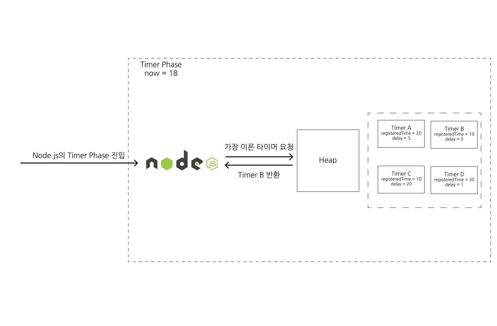
그림으로 다시 살펴보자. `Node.js`가 `Timer Phase`에 진입하면 `heap`으로부터 **가장 이른 타이머**를 요청한다. `min-heap`은 `O(1)`로 **가장 이른 타이머**를 반환한다. 위 예시에서는 타이머 B가 된다.

타이머 B를 받은 `Node.js`는 타이머를 **현재 실행할 수 있는지** 확인한다. `now(18) - registeredTime(10) >= delay(5)`이므로 타이머를 실행할 수 있다. 따라서 `Node.js`는 `Heap`에서 타이머 B를 제거하고 타이머 B와 연결된 **콜백**을 실행한다.
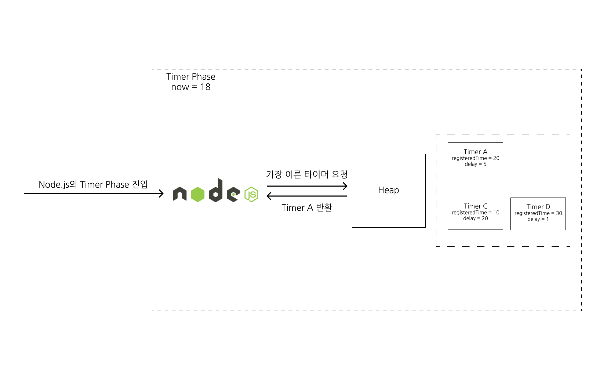
이어서 `Node.js`는 다시 `Heap`에게 **가장 이른 타이머**를 요청한다. 이번에는 `registeredTime + delay`가 가장 작은 타이머 A를 반환한다.

타이머 A를 받은 `Node.js`는 타이머를 **현재 실행할 수 있는지** 확인한다. `now(18) - registeredTime(20) >= delay(5)`가 성립하지 않으므로 타이머를 실행할 수 없다. 따라서 `Node.js`틑 타이머 A를 실행하지 않는다. **가장 이른 타이머**를 실행할 수 없으므로 `Heap`에 존재하는 모든 타이머를 실행할 수 없음이 당연하다. 따라서 `Node.js`는 `Heap`에게 더이상 타이머를 요청하지 않고 다음 페이즈로 넘어간다. 이는 `min-heap` 특성 덕분이다.

예를 들어 `delay`가 `50`, `150`, `200`, `500`, `3000`인 5개의 타이머(A, B, C, D, E)를 `0`초에 등록했다고 해보자. 코드로 보면 아래와 같다.

```js
// 0초
const A = setTimeout(fn, 50);
const B = setTimeout(fn, 150);
const C = setTimeout(fn, 200);
const D = setTimeout(fn, 500);
const E = setTimeout(fn, 3000);
```

그렇다면 타이머는 `min-heap`에 아래와 저장되어있다고 생각할 수 있다. 실제는 **이진 트리 구조**를 가져야 하지만 편의를 위해 단순히 **오름차순**으로 정렬되어있다고 해보자.

* 모든 타이머를 검사할 필요가 없는 경우

먼저 `Node.js`가 `Timer Phase`에 `30`에 진입했다고 해보자. `Node.js`는 먼저 `min-heap`에서 `A`를 꺼내서 검사한다. `A`의 `delay`는 `50`으로 `now(30) - registeredTime(0) >= delay(50)`이 성립하지 않으므로 `A`의 콜백을 실행하지 않는다. 이때 `Node.js`는 **오름차순**의 특성덕분에 뒤에있는 `B`, `C`, `D`, `E`를 검사할 필요가 없다. `A`를 실행할 수 없다면 뒤에 있는 타이머들은 당연히 실행할 수 없기 때문이다. 따라서 `Node.js`는 다음 페이즈로 넘어간다.
* 일부 타이머를 실행할 수 있는 경우

만약 `Node.js`가 `Timer Phase`에 `50`에 진입했다고 해보자. `Node.js`는 먼저 `min-heap`에서 `A`를 꺼내서 검사한다. `now(170) - registeredTime(0) >= delay(50)`이므로 `A`의 콜백을 실행하고 `A`의 타이머를 `heap`에서 제거한다. 

그리고 `heap`에서 `B` 타이머를 꺼내서 검사한다. `now(170) - registeredTime(0) >= delay(150)` 이므로 `B` 타이머의 콜백 또한 실행하고, `heap`에서 제거하고 타이머 `C`를 검사한다. `now(170) - registeredTime(0) >= delay(200)`은 `false`이므로 `C`의 콜백을 실행하지 않고 다음 페이즈로 넘어간다.
* 모든 타이머를 실행할 수 있음에도 불구하고 다음 페이즈로 넘어가는 경우

이때  `Timer Phase`는 **시스템의 실행 한도**에 영향을 받는다는 것을 주의해야 한다. **실행할 수 있는 타이머**가 남아있다고 해도 **시스템 실행 한도**에 다다르면 다음 페이즈로 넘어간다. 예를 들어 시스템의 실행 한도를 `3`이라고 해보자. `Node.js`가 `Timer Phase`에 `1000`에 진입했다고 했을 때 `Node.js`는 타이머 `D`까지 실행할 수 있음에도 불구하고 타이머 `A`, `B`, `C`까지만 실행하고 다음 페이즈로 넘어간다.
#### Timer Phase의 실제 코드
실제 `Node.js` 코드를 통해 자세히 살펴보면 아래와 같다.

먼저 `event loop`의 시간을 업데이트 하는 함수는 아래와 같다.
```c
UV_UNUSED(static void uv__update_time(uv_loop_t* loop)) {
  /* Use a fast time source if available.  We only need millisecond precision.
   */
  loop->time = uv__hrtime(UV_CLOCK_FAST)/1000000;
}
```
`uv__hrtime` 함수를 호출해 현재 시간을 얻고 이를 `ms` 단위로 변경해 `loop->time`에 저장하는 것을 알 수 있다.

여기서 주의해야 하는 점은 `event loop`에서 **현재 시간**을 사용해야 할 때 **코드를 실행하는 시점의 시간**을 사용하지 않는다는 것이다. 그 대신 `uv__update_time`을 호출했을 때 `loop->time`에 저장된 시간을 사용한다.
```c
void uv__run_timers(uv_loop_t* loop) {
  struct heap_node* heap_node;
  uv_timer_t* handle;

  for (;;) {
    heap_node = heap_min(timer_heap(loop)); // 힙에서 타이머를 꺼낸다
    if (heap_node == NULL){
      break;
    }

    handle = container_of(heap_node, uv_timer_t, heap_node);
    if (handle->timeout > loop->time){ // 만약 타이머의 콜백을 호출할 시간이 안되었다면 Timer Phase를 종료한다
      break;
    }

    uv_timer_stop(handle);
    uv_timer_again(handle);
    handle->timer_cb(handle); // 타이머의 콜백을 호출한다
  }
}
```
`heap_node = heap_min(timer_heap(loop));`

우선 `min-heap`에서 타이머를 꺼낸다. 이 `min-heap`은 **오름차순**으로 정렬되어 있으므로 당연히 저장된 타이머 중 **기준 시간**이 가장 이른 타이머다.
```c
if (heap_node == NULL){
  break;
}
```
만약 타이머가 `min-heap`에 없다면 `Timer Phase`를 종료한다.
```c
if (handle->timeout > loop->time){
  break;
}
```
만약 타이머에 저장된 `timeout`이 이벤트 루프의 **현재 시간**보다 크다면 아직 실행할 준비가 안되었으므로 `Timer Phase`를 종료한다. 여기서 아까 말했던 것처럼 하나라도 조건을 만족하지 않는 타이머를 발견하면 즉시 `Timer Phase`를 종료한다.

### Pending Callbacks Phase
 이 페이즈는 `pending_queue`에 담기는 콜백들을 관리한다. 이 큐에 담기는 콜백들은 **이전 이벤트 루프 반복**에서 수행되지 못했던 I/O 콜백들이다.

`Timer Phase`에서 말했듯이 대부분의 페이즈는 **시스템의 실행 한도**의 영향을 받는다. **시스템의 실행 한도 제한**에 의해 큐에 쌓인 모든 작업을 실행하지 못하고 다음 페이즈로 넘어갈 수도 있다. 이때 처리하지 못하고 넘어간 작업들을 쌓아놓고 실행하는 페이즈다.

에러 핸들러 콜백 또한 `pending_queue`로 들어오게 된다. `*nix`는 `TCP` 단에서 `ECONNREFUSED`를 받으면 `pending_queue`에 에러 핸들러를 추가한다.
```c
static int uv__run_pending(uv_loop_t* loop) {
  QUEUE* q;
  QUEUE pq;
  uv__io_t* w;

  if (QUEUE_EMPTY(&loop->pending_queue)) // pending_queue가 비어있다면 바로 0을 리턴한다
    return 0;

  QUEUE_MOVE(&loop->pending_queue, &pq);

  while (!QUEUE_EMPTY(&pq)) {
    q = QUEUE_HEAD(&pq);
    QUEUE_REMOVE(q);
    QUEUE_INIT(q);
    w = QUEUE_DATA(q, uv__io_t, pending_queue);
    w->cb(loop, w, POLLOUT); // 큐에 담겨있던 콜백을 실행한다
  }

  return 1;
}
```
실제 `Pending Callback Phase`에서 콜백을 실행하는 `uv_run_pending` 코드는 위와 같다.
* 만약 `pending_queue`에 담겨있는 콜백이 없다면 그 즉시 `0`을 리턴하고 다음 페이즈로 넘어간다.
* 만약 `pending_queue`에 콜백이 담겨있다면 **시스템의 실행 한도**를 넘기 전까지 큐에 있는 모든 콜백을 순서대로 실행한다. 그리고 `pending` 되었던 작업을 실행했다는 의미로 1을 반환한다. 

`uv_run_pending`의 반환값은 `event loop`의 `mode`가 `UV_RUN_ONCE`일 때 `Poll Phase`가 기다리는 시간을 결정하는데 영향을 끼친다. 하지만 `Node.js`의 `event loop`의 `mode`는 기본적으로 `UV_RUN_DEFAULT`이므로 신경쓰지 않아도 된다.

`event loop`의 `mode`는 `UV_RUN_DEFAULT`, `UV_RUN_ONCE`, `UV_RUN_NOWAIT`가 존재하며 각 `mode`에 대한 자세한 설명은 [공식 문서](http://docs.libuv.org/en/v1.x/loop.html#c.uv_run)에서 확인할 수 있다.
### Idle, Prepare Phase
이 페이즈들은 `Node.js`의 내부적인 관리를 위한 페이즈로 **자바스크립트**를 실행하지 않는다. 공식 문서에서도 별다른 설명이 없고 코드의 직접적인 실행에 영향을 미치지 않는다.
### Poll Phase
이 페이즈는 새로운 **I/O 이벤트**를 다루며 `watcher_queue`의 콜백들을 실행한다. `watcher_queue`에는 `I/O`에 대한 거의 모든 콜백들이 담긴다. 쉽게 말하면 `setTimeout`, `setImmediate`, close 콜백 등을 제외한 모든 콜백이 여기서 실행된다고 생각하면 된다. 예를 들면 아래와 같은 콜백들이 실행된다.

* 데이터베이스에 쿼리를 보낸 후 결과가 왔을 때 실행되는 콜백
* HTTP 요청을 보낸 후 응답이 왔을 때 실행되는 콜백
* 파일을 비동기로 읽고 다 읽었을 때 실행되는 콜백

#### Poll Phase가 콜백을 관리하는 방법
우선, `Poll Phase`가 어떻게 새로운 `I/O` 이벤트에 대한 콜백을 다루는지부터 알아보자. 위에서 `Poll Phase`가 `watcher_queue`에 담긴 콜백들을 관리한다고 했다. 하지만 `I/O` 이벤트는 타이머와 달리 **큐에 담긴 순서대로 `I/O` 작업이 완료되어 콜백 또한 차례대로 실행된다는 보장**이 없다. 데이터베이스에 `A`, `B` 쿼리를 순서대로 날려도 응답은 `B`, `A` 순서로 올 수도 있다. `A`를 `B`보다 먼저 실행하기 위해 `A` 응답이 올 때까지 `B` 콜백 처리를 미루는 것은 말도 안되는 일이다. 큐에 담긴 순서와 무관하게 `B`를 먼저 실행하는 것이 당연하다. 또한 실행 시간을 가지고 있던 타이머와 달리 `I/O` 이벤트는 `event loop` 혼자서는 언제 완료되었는지 알 수 없다. 이런 문제를 해결하기 위해 `Poll Phase`는 단순한 콜백 큐를 사용하지 않는다.

`event loop`가 `n`개의 열린 소켓을 가지고 있고 `n`개의 완료되지 않은 요청이 있다고 하자. 이 `n`개의 소켓에 대해 **소켓과 메타 데이터**를 가진 `watcher`를 관리하는 큐가 `watcher_queue`다. 그리고 각 `watcher`는 `FD(File Descriptor`를 가지고 있다. 이 `FD`는 네트워크 소켓, 파일 등등을 가리킨다.

운영 체제가 `FD`가 준비되었다고 알리면 `event loop`는 이에 해당하는 `watcher`를 찾을 수 있고 `watcher`가 맡고 있던 콜백을 실행할 수 있다. 

> `Poll Phase`도 **시스템 실행 한도**의 영향을 받는다.  

#### Poll Phase Blocking
`Node.js`가 `Poll Phase`에 진입했을 때 기다리고 있는 I/O 요청이 없거나, 아직 응답이 오지 않았다면 어떻게 할까? 그동안 살펴본 `Timer Phase`, `Pending Callbacks Phase`에서는 큐에 실행할 수 있는 작업이 없다면 다음 페이즈로 넘어갔다. 하지만 `Poll Phase`에서는 조금 다르게 동작한다.

페이즈 자신이 관리하는 큐만 확인하고 다음 페이즈로 넘기는 다른 페이즈들과는 달리 `Poll Phase`는 조금 더 영리하게 동작한다. **`Node.js`가 다음 페이즈로 이동해 다시 `Poll Phase`로 올 때까지 ~실행할 수 있는 작업~이 있는지**를 고려한다. 

`Poll Phase`에 진입해 콜백들을 실행해 `watcher_queue`가 비게 된다면, 또는 처음부터 `watcher_queue`가 비어있었다면 `event loop`는 `Poll Phase`에서 **잠시 대기할 수 있다.** 이때 대기하는 시간(`timeout`)은 아래 여러 조건에 의해 결정된다.

* 만약  이벤트 루프가 끝났다면(`uv_stop()`이 불렸다면) `timeout`은 `0`이다. 즉, 다음 페이즈로 바로 넘어간다.
* 만약 처리해야 할 비동기 작업이 없다면 `timeout`은 0이다. 다르게 말하면 당장 처리해야 하는(I/O 요청이 끝난) 비동기 처리가 없고 기다리고 있는 비동기 요청도 없다면 다음 페이즈로 바로 넘어간다
    * 당장 처리해야 하는 비동기 처리가 없고 기다리고 있는 비동기 요청도 없다면 지금 `Poll Phase`에서 대기한다고 실행할 수 있는 작업이 존재하지 않으므로 다음 페이즈로 넘어간다.
* 만약 `idle_handles`에 남아있는 핸들러가 있다면 `timeout`은 `0`이다. 즉시 다음 페이즈로 넘어간다. 
* 만약 `pending_queue`에 남아있는 작업이 있다면 `timeout`은 `0`이다. 즉시 다음 페이즈로 넘어간다. 
* 만약 남아있는 `close handlers`가 있다면 `tiemout`은 `0`이다. 즉시 다음 페이즈로 넘어간다. 
* 만약 남아있는 타이머가 없다면 `timeout`은 `-1`이다. 즉, 무한정 기다린다.
* 만약 남아있는 타이머가 있다면
    * 그 타이머를 즉시 실행할 수 있다면 `tiemout`은 0이다. 즉시 다음 페이즈로 넘어간다. 
    * 그 타미어를 즉시 실행할 수 없다면 실행할 수 있을 때까지 대기해야 하는 시간이 `tiemout`이 된다. 타이머를 실행할 수 있을 때까지 기다리고 다음 페이즈로 넘어간다.

간단하게 요약하면 아래와 같다.

* 이벤트 루프가 종료되었다면 바로 다음 페이즈로 넘어간다.
* 만약 `Close Callbacks Phase`, `Pending Callbacks Phase`에서 실행할 작업이 있다면 바로 다음 페이즈로 넘어간다.
* 만약 `Timer Phase`에서 즉시 실행할 수 있는 타이머가 있다면 바로 다음 페이즈로 넘어간다.
* 만약 `Timer Phase`에서 즉시 실행할 수 있는 타이머는 없지만 `n`초 후에 실행할 수 있는 타이머가 있다면 `n`초 기다린 후 다음 페이즈로 넘어간다.

> '당장 처리해야 하는 비동기 처리가 없고 기다리고 있는 비동기 요청도 없다면' 이라는 표현은 사실 모호하다. 코드 상에서는 `!uv__has_active_handles(loop) && !uv__has_active_reqs(loop)`와 같다. 사실 이 조건은 `event loop`에 남아있는 `close handler`가 없는 경우 `event loop`가 죽어있는 조건이다. 정확히 `active_handles`과 `uv__has_active_reqs`이 무엇을 의미하는 지는 알 수 없었지만 적어도 아래 의미 정도를 유추할 수 있다.  
> 만약 `!uv__has_active_handles(loop) && !uv__has_active_reqs(loop)`이 성립하지 않는 경우 다른 명확한 조건에 의해 `timeout`이 결정되므로 성립하는 경우에 대해서만 살펴보자. 아래와 같은 케이스가 가능하다.  
> 1. 만약 남아있는 `close handlers`가 있는 경우 이벤트 루프가 살아있는 경우다. `Poll Phase`에서 바로 `Check Phase`로 넘어가고 `Close Callbacks Phase`에 도달하면 남아있던 `close_handlers`를 실행한다. 결국 남아있는 작업이 없어지므로 이벤트 루프는 죽고 `uv__loop_alive(loop)`는 `false`다. `Close Callbacks Phase`가 끝나면 이벤트 루프가 살아있는지 검사하고 죽었다면 종료하므로 그대로 프로그램은 종료된다.  
> 2. 만약 남아있는 `close handlers`가 없는 경우 이벤트 루프가 죽은 경우다. 따라서 `uv__loop_alive(loop)`는 `false`다. `Poll Phase`에서 바로 `Check Phase`로 넘어가고 `Close Callbacks Phase`에 도달해도 실행할 수 있는 작업이 없다. 따라서 이벤트 루프가 살아있는지 검사하고 죽었다면 종료하므로 그대로 프로그램은 종료된다.  
> 결과적으로 보면 남아있은 작업들을 마무리하고 바로 이벤트 루프를 종료하므로 `Poll Phase`에서 기다리지 않고 바로 다음 페이즈로 넘어가는 케이스라고 생각할 수 있다.  

#### Blocking I/O
지금까지 `Poll Phase`에서 수행하는 2가지 기능을 알아보았다.
1. `FD`와 `watcher_queue`를 이용해 `I/O 요청`이 완료되면 콜백을 실행한다. 
2. `watcher_queue`에서 현재 완료된 `I/O 요청`이 없다면 결정된 대기시간(`timeout`)만큼 기다리다가 다음 페이즈로 넘어간다.

1번 과정의 경우 다른 페이즈와 크게 다르지 않아 쉽게 이해할 수 있지만 2번 과정의 경우 잘 와닿지 않는다. `Blocking I/O`는 어떤 뜻인지, `timeout` 시간은 정확히 어떻게 활용되는지, `timeout` 시간 동안 `Node.js` 자체가 `Blocking`되는 것인지? 헷갈렸었다. 

`libuv` [공식 문서](http://docs.libuv.org/en/v1.x/design.html)를 통해 찾아보니 아래와 같은 설명을 찾을 수 있었다.
> Poll timeout is calculated. Before blocking for I/O the loop calculates for how long it should block.  
> ...  
> Poll Phase  
> The loop blocks for I/O. At this point the loop will block for I/O for the duration calculated in the previous step. All I/O related handles that were monitoring a given file descriptor for a read or write operation get their callbacks called at this point.  

우선, 계산한 `timeout`은 정확히는 **대기 시간**이 아니라 `Block`하는 시간이다. 그리고 `Poll Phase`에서는 `timeout`만큼 `block for I/O`한다고 명시되어 있다. [이 질문](https://github.com/libuv/libuv/discussions/3256)에 따르면 `timeout` 값에 따라 아래와 같이 동작이 달라진다. `OS`에 따라서 세부 구현은 달라지지만 예를 들어 `Linux`가 사용하는 `epoll`의 경우를 살펴보자.
```c
// https://github.com/nodejs/node/blob/4f688399105377178fd1ebfafe8a80bc0357ffe2/deps/uv/src/unix/epoll.c#L103
typedef union epoll_data {
    void    *ptr;
    int      fd;
    uint32_t u32;
    uint64_t u64;
} epoll_data_t;
struct epoll_event {
    uint32_t     events;    /* Epoll events */
    epoll_data_t data;      /* User data variable */
};

void  uv__io_poll(uv_loop_t* loop, int timeout) {
struct epoll_event events[1024];
// ...
nfds = epoll_wait(loop->backend_fd,
                  events,
                  ARRAY_SIZE(events),
                  timeout);
// ...
}
```
`epoll_wait` 함수는 `events`라는 `epoll_event` 구조체 배열을 통해 현재 기다리고 있는 `FD`의 배열을 전달받는다. `epoll_wait` 함수는 `FD`배열을 이용해 `I/O` 요청이 완료되었는지 확인하고 완료된 `FD`의 수를 반환한다. 만약 에러가 발생하면 `-1`을 반환한다. 이때 `timeout` 값에 따라서 `epoll_wait` 함수의 반환 시점이 달라진다.

* 만약 `timeout`이 `0`인 경우 전달 받은 `FD` 중 완료된 `I/O` 요청이 없더라도 즉시 완료된 `FD`의 수를 반환한다.
* 만약 `timeout`이 `0`보다 큰 경우 완료된 `I/O` 요청이 없다면 요청이 생길 때까지 `Block`하며 기다린다. 만약 `timeout` 전에 `I/O` 요청이 완료되거나 모든 `I/O` 요청이 완료되지 않고 `timeout`이 지나면 완료된 `FD`의 수를 반환한다. 
* 만약 `timeout`이 `-1`인 경우 `timeout` 없이 `I/O` 요청이 완료될 때까지 무한정 기다린다. 
    * 정확히는 [상수](https://github.com/nodejs/node/blob/4f688399105377178fd1ebfafe8a80bc0357ffe2/deps/uv/src/unix/epoll.c#L112)에 의해 최대 **30분**까지 기다린다.

이에 대한 정확한 설명은 [공식 문서](https://linux.die.net/man/2/epoll_pwait)에서 찾아볼 수 있다.

> The *timeout* argument specifies the minimum number of milliseconds that **epoll_wait**() will block  
> `timeout` 파라미터는 `epoll_wait`이 block되는 최소 시간(`ms`)를 말한다.   
>   
> Specifying a *timeout* of -1 causes **epoll_wait**() to block indefinitely, while specifying a *timeout* equal to zero cause **epoll_wait**() to return immediately, even if no events are available.  
> `timeout`이 `-1`인 경우 무한정 `block`한다. 만약 `timeout`이 0인 경우 `I/O` 이벤트가 아직 발생하지 않았더라고 즉시 리턴한다.  

즉, 정리하면 아래와 같은 동작을 한다고 생각할 수 있다.

* 만약 `timeout`이 `0`인 경우 `I/O` 요청이 완료되는 것을 기다리지 않는다. 완료된 `I/O` 요청이 없다면 바로 다음 페이즈로 넘어간다[[구현](https://github.com/nodejs/node/blob/4f688399105377178fd1ebfafe8a80bc0357ffe2/deps/uv/src/unix/epoll.c#L267)]. 이미 완료된 `I/O` 요청이 있다면 콜백을 실행하고[[구현](https://github.com/nodejs/node/blob/4f688399105377178fd1ebfafe8a80bc0357ffe2/deps/uv/src/unix/epoll.c#L374)] 다음 페이즈로 넘어간다[[구현](https://github.com/nodejs/node/blob/4f688399105377178fd1ebfafe8a80bc0357ffe2/deps/uv/src/unix/epoll.c#L406)].
*  만약 `timeout`이 `0`보다 큰 경우 
* 만약 `timeout`이 `-1`인 경우 `I/O` 요청이 완료될 때까지 [최대 30분](https://github.com/nodejs/node/blob/4f688399105377178fd1ebfafe8a80bc0357ffe2/deps/uv/src/unix/epoll.c#L112) 기다린다. 일부 `I/O` 요청만 완료되고 아직 완료되지 않은 `I/O` 요청이 있다면 다시 최대 30분까지 `I/O` 요청이 완료되는 것을 기다린다.

`uv__io_poll`의 경우 `OS`마다 구현체도 다르고 코드도 매우 복잡해 코드 설명은 하지 않는다. 다만, 코드를 분석하면서 주석을 적어놨으니 더 자세한 내용이 궁금하다면 [여기](https://github.com/korECM/node/blob/c1c42ca39510c6117c9625a16b92208a95e84a71/deps/uv/src/unix/epoll.c#L103)를 참고하면 좋을 것 같다.

### Check Phase

이 페이즈는 오직 `setImmediate`의 콜백만을 위한 페이즈다. `setImmediate`가 호출되면 `Check Phase`의 큐에 담기고 `Node.js`가 `Check Phase`에 진입하면 차례대로 실행된다.

공식 문서에서 `setImmediate`와 `process.nextTick`의 차이에 주목하고 있다. 정리하면 아래와 같다.

* `process.nextTick`은 같은 페이즈에서 호출한 즉시 실행된다.
* `setImmediate`는 다음 틱에서 실행된다. 정확히는 `Node.js`가 틱을 거쳐 `Check Phase`에 진입하면 실행된다.

따라서 동작만 보면 `process.nextTick`은 **즉시** 실행되고 `setImmediate`는 **다음 틱**에 실행된다. [공식 문서](https://nodejs.org/ko/docs/guides/event-loop-timers-and-nexttick/#process-nexttick-setimmediate)에서도 두 이름은 바뀌어야 한다고 이야기한다. 하지만 이미 많은 모듈을이 `process.nextTick`과 `setImmediatge`의 뒤바뀐 동작에 의존해 동작하고 있어 이름을 바꾸지 못했다고 **공식 문서**에서 이야기하고 있다.

### Close Callbacks Phase
`socket.on('close', () => {});`과 같은 `close` 이벤트 타입의 핸들러를 처리하는 페이즈다. 정확하게는 `uv_close()`를 부르면서 종료된 핸들러의 콜백들을 처리하는 페이즈다.

```c
static void uv__run_closing_handles(uv_loop_t* loop) {
  uv_handle_t* p;
  uv_handle_t* q;

  p = loop->closing_handles;
  loop->closing_handles = NULL;

  while (p) { // close queue에 담긴 콜백을 실행한다
    q = p->next_closing;
    uv__finish_close(p);
    p = q;
  }
}
```

실제 `Close Callbacks` 페이즈의 코드는 위와 같다.

**시스템 실행 한도**를 초과하기 전까지 `closing_handles`에 담긴 작업을 순서대로 실행한다.

### nextTickQueue, microTaskQueue
`nextTickQueue`와 `microTaskQueue`는 앞에서 말했듯이 **이벤트 루프**의 일부가 아니다. 정확히는 `libuv`에 포함되어 있지 않고  `Node.js`에 구현되어 있다. 따라서 이벤트 루프의 **페이즈**와 상관없이 동작한다.

`nextTickQueue`는 `process.nextTick()`의 콜백을 관리하며 `microTaskQueue`는 `Resolve`된 프라미스 콜백을 가지고 있다. `nextTickQueue`와 `microTaskQueue`는 현재 페이즈와 상관없이 **지금 수행하고 있는 작업**이 끝나면 그 즉시 바로 실행한다. 

`nextTickQueue`는 `microTaskQueue`보다 **높은 우선순위**를 가지므로 더 먼저 실행된다.
```js
Promise.resolve().then(() => console.log('resolve'))
process.nextTick(() => console.log('nexTick'))
/*
nexTick
resolve
*/
```
다른 페이즈들과는 다르게 `nextTickQueue`와 `microTaskQueue`는 **시스템의 실행 한도**의 영향을 받지 않는다. 따라서 `Node.js`는 큐가 비워질 때까지 콜백들을 실행한다.
```js
const fn = () => {
    process.nextTick(fn)
}

setTimeout(() => {
    console.log("Timer")
},0 )

fn()
```
따라서 위와 같은 코드가 실행되면 영원히 `Timer`는 출력되지 않는다.

#### nextTickQueue와 microTaskQueue의 동작 변화

사실 `nextTickQueue`와 `microTaskQueue`, 그리고 여러 **페이즈**간의 동작 순서는 `Node.js`의 버전에 따라 다르다. 정확히는 `Node v11.0.0`을 기점으로 달라졌다. 지금까지 설명한 동작 방식은 `Node v11.0.0`이후의 방식이다.

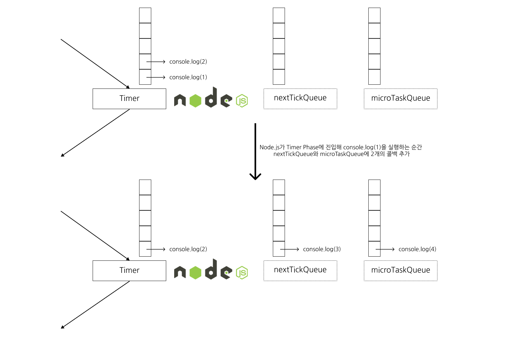

위와 같은 상황을 생각해보자. 코드로 보면 아래와 같다.

```javascript
setTimeout(() => {
    console.log(1)
    process.nextTick(() => {
        console.log(3)
    })
    Promise.resolve().then(() => console.log(4))
}, 0)
setTimeout(() => {
    console.log(2)
}, 0)
```
`Node v11.0.0` 이전에는 **한 페이즈**에서 **다음 페이즈**로 넘어가기 전에 `nextTickQueue`와 `microTaskQueue`를 검사했다. 즉, **매 틱**마다 검사했다.

위 코드에서는 아래와 같은 순서로 실행된다.

1. `Node.js`가 `Timer Phase`에 진입
2. 우선 `Timer Phase`에 있는 큐를 확인하고 `console.log(1)` 실행
3. `process.nextTick`과 `Promise.resolve`를 호출해 `nextTickQueue`와 `microTaskQueue`에 콜백을 등록
4. `Node.js`는 다시 `Timer Phase`에 있는 큐를 확인하고 `console.log(2)`를 실행
5. `Node.js`는 다시 `Timer Phase`에 있는 큐를 확인하고 비어있으므로 다음 페이즈로 넘어가려 함
6. `Pending Callbacks Phase`에 진입하기 전 우선순위가 높은 `nextTickQueue`부터 확인
7. `console.log(3)` 실행
8. `nextTickQueue`가 비었음을 확인하고 우선순위가 낮은 `microTaskQueue` 확인
9. `console.log(4)` 실행
10. `microTaskQueue`가 비었음을 확인하고 `Pending Callbacks Phase`로 이동

하지만 `Node v11.0.0` 이후에는 **현재 실행하고 있는 작업**이 끝나면 즉시 실행하도록 변경되었다.

위 코드는 아래와 같은 순서로 실행된다.

 1. `Node.js`가 `Timer Phase`에 진입
 2. 우선 `Timer Phase`에 있는 큐를 확인하고 `console.log(1)` 실행
 3. `process.nextTick`과 `Promise.resolve`를 호출해 `nextTickQueue`와 `microTaskQueue`에 콜백을 등록
 4. 현재 실행하고 있는 작업이 끝났으므로 `Node.js`는 `nextTickQueue`와 `microTaskQueue`에 작업이 있음을 확인 -> `Timer Phase`의 큐를 확인하지 않고 우선순위가 높은 `nextTickQueue` 부터 확인
 5. `console.log(3)` 출력
 6. `Node.js`는 `nextTickQueue`가 비었음을 확인하고 우선순위가 낮은 `microTaskQueue` 확인
 7. `console.log(4)` 출력
 8. `microTaskQueue`가 비었음을 확인하고 다시 `Node.js`는 `Timer Phase`에 있는 큐를 확인하고 `console.log(2)` 실핼
 9. 현재 실행하고 있는 작업이 끝났으므로 `Node.js`는 `nextTickQueue`와 `microTaskQueue`에 작업이 있음을 확인 -> `Timer Phase`의 큐가 비었음을 확인하고 `Pending Callbacks Phase`로 이동

실제로 `Node` 버전에 따라서 아래처럼 출력 결과가 달라진다.

```js
setTimeout(() => {
    console.log(1)
    process.nextTick(() => {
        console.log(3)
    })
    Promise.resolve().then(() => console.log(4))
}, 0)
setTimeout(() => {
    console.log(2)
}, 0)
/*
> npx -p node@10 node test.js
1
2
3
4
❯ npx -p node@11 node test.js
1
3
4
2
*/
```
`Node v10.0.0`에서는 **한 페이즈**에서 **다음 페이즈**로 넘어갈 때 `nextTickQueue`와 `microTaskQueue`를 검사한다. 즉, 위 예제에서는 `Timer Phase`의 콜백 2개를 실행하고 나서야 `nextTickQueue`에 있는 콜백을 실행할 수 있다. 따라서 `setTimeout`의 콜백들이 모두 실행되고 나서 `process.nextTick`의 콜백들이 실행된다.

하지만 `Node v11.0.0`에서는 **현재 실행하고 있는 작업**이 끝나면 즉시 큐를 검사하고 실행한다. 따라서 `Node v10.0.0`과는 달리 `setTimeout`의 콜백을 먼저 하나 실행하고 그 즉시, `process.nextTick`의 콜백을 실행한다.  따라서 `3`보다 `2`가 먼저 출력된다.

`Node v11.0.0`에서 실행 순서가 바뀌게 된 이유는 바로 브라우저와의 일관성때문이다. `Node.js`는 브라우저에서 실행하던 `Javascript`를 로컬에서 실행하게 해주는 런타임이다. 그러나 브라우저는 `Node v11.0.0`의 실행 순서를 따르고 있었기에 같은 자바스크립트 코드더라도 `Node v10`과 브라우저의 실행 결과가 동일하지 않았다.

이러한 문제를 해소하기 위해서 `Node v11.0.0`에서는 브라우저와 같은 실행 순서를 가지도록 변경되었다.

## 예제
각 페이즈에서 어떤 코드들이 실행되는지 쉽게 알기 위해서 공식 `Node.js` 레포에 주석을 추가하고 페이즈 상태에 대한 로깅을 추가했다. 만약 여러 예제 코드를 보면서 각 페이즈에 어떤 코드들이 실행되는지 헷갈린다면 [이 레포](https://github.com/korECM/node)를 클론받아 빌드하면 아래와 같은 실행 결과를 얻을 수 있다. 다만 `Mac OS X`에서만 테스트되었고 다른 환경에서는 정상적으로 로깅되는지 확인하지 못했다.
```javascript
// test.js
setTimeout(() => {
    console.log("setTimeout")
}, 0)
setImmediate(() => {
    console.log("setImmediate")
})

❯ ./node test.js
// ...
Timer Phase[uv__run_timers] Enter
  FIND TIMER
  TOO EARLY TO EXECUTE TIMER CALLBACK 11922025 > 11922024 
Timer Phase[uv__run_timers] Exit
// ...
Poll Phase[uv__io_pole] Exit
Check Phase[uv__run_check] Enter
setImmediate
Check Phase[uv__run_check] Exit
Close Callbacks Phase[uv__run_closing_handles] Enter
Close Callbacks Phase[uv__run_closing_handles] Exit
Timer Phase[uv__run_timers] Enter
  FIND TIMER
  RUN TIMER CALLBACK START 
====================
setTimeout
====================
  RUN TIMER CALLBACK END 
  NO TIMER LEFT
Timer Phase[uv__run_timers] Exit
Pending Callbacks Phase[uv__run_pending] Enter
Pending Callbacks Phase[uv__run_pending] Exit
Calculated Poll Phase timeout = 0
Poll Phase[uv__io_pole] Enter
  POLL FOR timeout 0 Start
  POLL FOR End. polling result : 0
  There is no completed I/O Request
Poll Phase[uv__io_pole] Exit
Check Phase[uv__run_check] Enter
// ...
UV_RUN_ONCE
Timer Phase[uv__run_timers] Enter
  NO TIMER LEFT
Timer Phase[uv__run_timers] Exit
```


작성 중
## 출처
* [Node.js 이벤트루프 제대로 이해하기 - 기술블로그](https://tk-one.github.io/2019/02/07/nodejs-event-loop/)
* [https://stackoverflow.com/questions/40880416/what-is-the-difference-between-event-loop-queue-and-job-queue](https://stackoverflow.com/questions/40880416/what-is-the-difference-between-event-loop-queue-and-job-queue)
* [https://blog.actorsfit.com/a?ID=00001-994e17b0-071b-45e4-aa90-d345fc5d2acc](https://blog.actorsfit.com/a?ID=00001-994e17b0-071b-45e4-aa90-d345fc5d2acc)
* [https://blog.logrocket.com/a-complete-guide-to-the-node-js-event-loop/](https://blog.logrocket.com/a-complete-guide-to-the-node-js-event-loop/)
* [Node.js 동작원리 (Single thread, Event-driven, Non-Blocking I/O, Event loop) | by vincent | Medium](https://medium.com/@vdongbin/node-js-%EB%8F%99%EC%9E%91%EC%9B%90%EB%A6%AC-single-thread-event-driven-non-blocking-i-o-event-loop-ce97e58a8e21)
* [zz_blog/node事件循环.md at db1715474eb961ae5e274243c2fa171d65a11a8d · redsx/zz_blog · GitHub](https://github.com/redsx/zz_blog/blob/db1715474eb961ae5e274243c2fa171d65a11a8d/nodejs/node%E4%BA%8B%E4%BB%B6%E5%BE%AA%E7%8E%AF.md)
* [nodejs의 내부 동작 원리 (libuv, 이벤트루프, 워커쓰레드, 비동기)](https://sjh836.tistory.com/149)
* [Understanding Event Loop, Call Stack, Event & Job Queue in Javascript | by Rahul Sagore | Medium](https://medium.com/@Rahulx1/understanding-event-loop-call-stack-event-job-queue-in-javascript-63dcd2c71ecd)
* [이벤트 루프 Job Queue , Event Queue 차이? :: Heimishi Place](https://heimishiplace.tistory.com/133)
* [https://medium.com/geekculture/understand-the-node-js-event-loop-22f74906b77f](https://medium.com/geekculture/understand-the-node-js-event-loop-22f74906b77f)
* [How the Node.js Event Loop Polls](https://www.atomiccommits.io/event-loop-polling/)
* [https://www.fatalerrors.org/a/nodejs-series-q-a-s-understanding-of-event-loop-timers-and-process.nexttick.html](https://www.fatalerrors.org/a/nodejs-series-q-a-s-understanding-of-event-loop-timers-and-process.nexttick.html)
* [Event loop 와 Task queue 동작 이해하기](https://velog.io/@bang9dev/event-loop-task-queue)
* [https://github.com/libuv/libuv/discussions/3256](https://github.com/libuv/libuv/discussions/3256)
* [Design overview — libuv documentation](http://docs.libuv.org/en/v1.x/design.html)
* [https://linux.die.net/man/2/epoll_pwait](https://linux.die.net/man/2/epoll_pwait)
* [uv_loop_t — Event loop — libuv documentation](http://docs.libuv.org/en/v1.x/loop.html#c.uv_run)
* [API documentation — libuv documentation](http://docs.libuv.org/en/v1.x/api.html)
* [Understanding the Node.js event loop phases and how it executes the JavaScript code. - DEV Community](https://dev.to/lunaticmonk/understanding-the-node-js-event-loop-phases-and-how-it-executes-the-javascript-code-1j9)
* [Node.js 이벤트 루프, 타이머, `process.nextTick()` | Node.js](https://nodejs.org/ko/docs/guides/event-loop-timers-and-nexttick/#node-js-process-nexttick)
* [로우 레벨로 살펴보는 Node.js 이벤트 루프 | Evans Library](https://evan-moon.github.io/2019/08/01/nodejs-event-loop-workflow/)
* [https://stackoverflow.com/questions/68613169/in-which-phase-of-nodejs-event-loop-resolved-promises-callbacks-get-executed](https://stackoverflow.com/questions/68613169/in-which-phase-of-nodejs-event-loop-resolved-promises-callbacks-get-executed)
* [이벤트 루프(Event Loop)란?](https://kay0426.tistory.com/23#footnote_23_3)
* [node.js node.js의 이벤트루프와 libuv의 이해 : 네이버 블로그](https://m.blog.naver.com/pjt3591oo/221976414901)
* [https://stackoverflow.com/questions/46485392/poll-phase-in-nodejs-event-loop](https://stackoverflow.com/questions/46485392/poll-phase-in-nodejs-event-loop)
* [https://developer.ibm.com/tutorials/learn-nodejs-the-event-loop/](https://developer.ibm.com/tutorials/learn-nodejs-the-event-loop/)
* [https://stackoverflow.com/questions/64264617/when-is-process-nexttick-in-the-nodejs-event-loop-called](https://stackoverflow.com/questions/64264617/when-is-process-nexttick-in-the-nodejs-event-loop-called)
* [https://blog.insiderattack.net/promises-next-ticks-and-immediates-nodejs-event-loop-part-3-9226cbe7a6aa](https://blog.insiderattack.net/promises-next-ticks-and-immediates-nodejs-event-loop-part-3-9226cbe7a6aa)
* [https://www.reddit.com/r/node/comments/75m6cx/libuv_how_is_the_poll_phase_differentiated_from/?st=ja484wrx&sh=4c279c13](https://www.reddit.com/r/node/comments/75m6cx/libuv_how_is_the_poll_phase_differentiated_from/?st=ja484wrx&sh=4c279c13)
* [Don't Block the Event Loop (or the Worker Pool) | Node.js](https://nodejs.org/ko/docs/guides/dont-block-the-event-loop/#how-does-node-js-decide-what-code-to-run-next)
* [https://github.com/nodejs/help/issues/1118#issuecomment-388280608](https://github.com/nodejs/help/issues/1118#issuecomment-388280608)
* [https://www.youtube.com/watch?v=P9csgxBgaZ8](https://www.youtube.com/watch?v=P9csgxBgaZ8)


