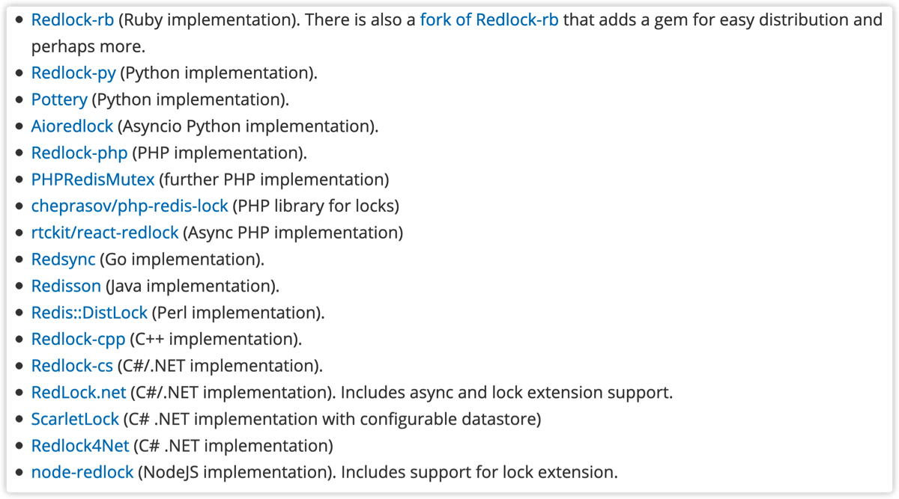
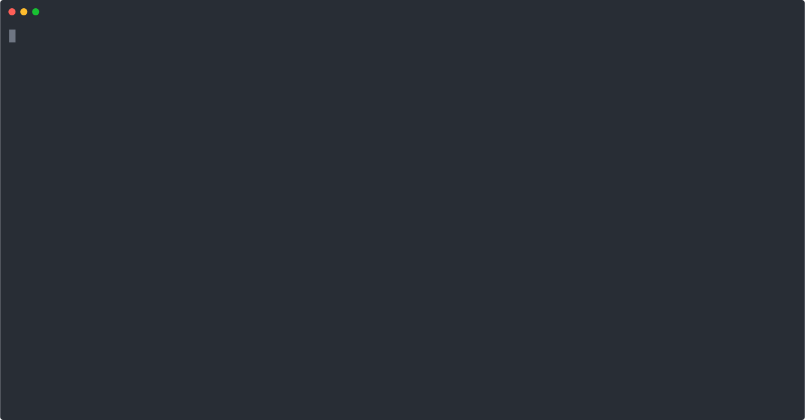

## 분산락이란

**분산 락**(**Distributed Lock**)은 여러 프로세스가 상호 배타적으로 공유되는 자원을 다뤄야 하는 경우 유용하게 사용됩니다. 하나의 프로세스 내에서 여러 스레드에 대해서 락을 걸어야 한다면 언어에서 제공해주는 `Synchoronize` 기능이나 `Lock` 등을 활용할 수 있지만 여러 프로세스 또는 물리적으로 분리된 서버에서 Lock을 걸어야 한다면 이런 방법을 사용할 수 없습니다. 대신 여러 서버 간의 세션 정보를 공유하기 위해서 `Redis`를 사용하는 것처럼 분산 락을 구현하기 위해서 레디스를 사용할 수도 있습니다.

실제로 [레디스 공식 문서](https://redis.io/topics/distlock#implementations)에서 레디스로 **분산 락 매니저**(**DLM: Distributed Lock Manager**)를 구현한 라이브러리들을 소개하고 있습니다. 라이브러리마다 조금씩 다른 점근 방식을 사용하고 있으며 복잡한 구현 방식을 택하는 대신 간단한 접근 방식을 사용함으로써 낮은 보증을 제공하기도 합니다.




이 글은 레디스 공식 문서에서 설명하는 단일 인스턴스에서의 분산 락 구현 방법과 문제점, 그리고 효율적인 분산 락 구현 방법에 대해 이야기해보려 합니다. 단일 인스턴스로 구성된 비분산 시스템에서의 분산 락 알고리즘부터 이를 활용한 분산 시스템에서의 분산 락 알고리즘 [Redlock](https://redis.io/topics/distlock#the-redlock-algorithm)을 소개하고 있으니 이 글과 함께 살펴보면 좋을 것 같습니다.

## 분산 락의 속성

우리가 구현하려는 분산 락은 아래 세가지 속성을 보장해야 합니다.

* Safety Property
* Liveness Property A
* Liveness Property B

**Safety Property**는 특정 순간에 한 클라이언트만 락을 획득할 수 있다는 **상호 배제성**을 의미합니다. 동시에 여러 클라이언트가 락을 획득하려 했을 때 한 개 이상의 클라이언트가 락을 획득하는 것을 막아야 한다는 개념입니다. 락의 기본적인 역할이라고 할 수 있습니다.

**Liveness Property A**는 만약 락을 획득한 클라이언트에 장애가 발생해 정상적으로 락을 반납하지 못했을 때 영영 다른 클라이언트들이 락을 획득할 수 없는 **데드락**이 발생해서는 안된다는 것을 의미합니다. 락을 가져가서 오랫동안 반납하지 않을 때 락을 가져간 클라이언트가 정상적으로 락을 반납할 수 없다고 판단해 락을 회수하고 기다리고 있는 다른 클라이언트에게 락을 제공할 수 있어야한다는 뜻입니다. 만약 이런 사실이 보장되지 않는다면 데드락이 발생했을 때 락을 사용하는 모든 요청을 처리할 수 없게되고 기다리다가 타임 아웃만 발생할 수도 있습니다.

**Liveness Property B**는 여러 레디스 노드가 존재하는 경우, 일부 노드에 장애가 발생하더라도 클라이언트는 정상적으로 락을 획득하고 반납할 수 있어야 합니다. 즉, 어느 정도의 **결함 허용성**(**Fault Tolerance**)를 지녀야 합니다.


## 단일 인스턴스로 구성된 레디스에서의 분산 락 구현

단일 인스턴스로 구성된 레디스를 사용해 분산 락을 구현하는 방법은 아래와 같습니다.

* 락을 획득할 때 키를 생성합니다. 만약 키가 이미 존재한다면 다른 클라이언트가 이미 락을 획득한 것이므로 키가 삭제될 때까지 기다립니다.
* 락을 반납하면서 키를 삭제합니다. 키가 삭제되면 기다리고 있던 다른 클라이언트 중 하나가 락을 획득하게 됩니다.

만약 키의 존재 여부를 확인하고 키를 생성하는 연산이 `원자적`으로 이루어질 수 있다면 **Safety Property**를 보장할 수 있습니다. 하지만 **Liveness Property A**와 **Liveness Property B**는 보장할 수 없습니다. 키를 획득한 클라이언트에 장애가 발생해 명시적으로 키를 삭제하지 못해 락은 (개념적으로)반납 되었지만 키는 여전히 남아있기 때문입니다.

레디스에서 제공하는 `EXPIRES` 기능을 사용하면 **Liveness Property A**를 보장할 수 있습니다. 명시적으로 키를 삭제하지 못해도 시간이 지나면 레디스가 키를 삭제해주기 때문입니다. 하지만 여전히 **Liveness Property B**는 보장할 수 없습니다. 단일 인스턴스로 구성되어 있어 인스턴스 하나에서 장애가 발생하면 레디스 전체에 장애가 발생하게 되기 때문입니다. 

자 이제 위에서 구상한 방법을 실제로 사용해보면 아래와 같습니다.

```swift
SET resource_name random_value NX PX 30000
```

`NX` 옵션은 키가 존재하지 않는 경우에만 키를 생성한다는 것을 의미합니다. 키 생성에 성공한 경우 `OK` 응답이 오고 키가 이미 존재해 실패한 경우 `(nil)` 응답이 오게 됩니다. 레디스는 싱글 스레드로 동작하며 들어온 명령어들을 순차적으로 처리해나갑니다. 즉, 명령어 하나하나의 실행이 원자성을 지닙니다. 따라서 키의 존재 여부를 확인하고 키를 생성하는 연산을 원자적으로 수행할 수 있으며 키 생성 여부 또한 알 수 있습니다. 키 생성에 성공해 `OK` 응답이 오면 락을 획득한 것입니다.

`PX` 옵션은 `ms` 단위로 키의 만료 시간을 설정하는 것을 의미합니다. `PX 30000` 은 **30 초** 뒤에 키가 만료되어 자동으로 삭제됨을 의미합니다. 위에서 말했듯이 만료 시간을 설정함으로써 **Liveness Property A**를 보장할 수 있습니다. `PX` 대신 `EX` 옵션을 사용해도 됩니다.

`SET` 명령어에 사용할 수 있는 옵션들은 [공식 문서](https://redis.io/commands/set)에서 확인할 수 있습니다.

키는 자원의 이름을 의미하며 락을 구분하는 단위입니다. 키 이름을 다르게 함으로써 하나의 레디스로 여러 분산 락을 사용할 수도 있습니다.

키에 저장되는 값은 무작위 값을 가집니다. 즉, 모든 클라이언트의 잠금 요청에서 고유한 값을 가져야 합니다. 예를 들면 다음과 같습니다.

* 클라이언트 A가 DB(키 이름)에 대한 락을 획득합니다. 이 때 값은 1로 설정합니다.
* 클라이언트 A가 DB에 대한 작업을 마무리한 뒤 키를 삭제합니다.
* 클라이언트 B가 DB에 대한 락을 획득합니다. 이 때 값은 2로 설정합니다.
* 클라이언트 B가 DB에 대한 작업을 마무리한 뒤 키를 삭제합니다.
* 클라이언트 A가 DB에 대한 락을 획득합니다. 이 때 값은 3로 설정합니다.

값은 모든 요청에 대해서 무작위 값을 가져야 합니다. 정확히는 락을 기다리고 있는 클라이언트가 예측할 수 없는 값을 사용해야 합니다. 따라서 클라이언트마다 다른 값을 사용하는 것은 물론이고 같은 클라이언트라도 매 요청마다 설정하는 값이 달라져야 합니다.

이러한 무작위 값을 사용하는 이유는 락을 획득한 클라이언트만이 락을 반납할 수 있기 때문입니다. 클라이언트가 락을 획득해 키를 만들었다면 그 클라이언트가 키를 삭제해야합니다. 락을 기다리고 있는 다른 클라이언트가 임의로 키를 삭제해버려서는 안됩니다. 따라서 `Lua` 스크립트를 사용해 레디스에게 아래와 같이 요청을 보냄으로써 락을 반납해야 안전하게 락을 다룰 수 있습니다. `Lua` 스크립트에 대한 자세한 내용은 [공식 문서](https://redis.io/commands/eval)에서 확인할 수 있습니다.

```swift
if redis.call("get", KEYS[1]) == ARGV[1] then
	return redis.call("del", KEYS[1])
else
	return 0
end
```

먼저 주어진 키로 값을 가져옵니다. 만약 키가 존재하지 않아 `(nil)`을 반환받거나 가져온 값이 `ARGV[1]`과 일치하지 않는 경우 즉, 키가 존재하지 않거나 다른 클라이언트가 획득한 락을 반납하려고 시도하는 경우 0을 반환합니다. 만약 키가 존재하고 내가 획득했던 락이라면 키를 삭제하고 1(삭제한 키의 개수)를 반환합니다.

이는 `Lua` 스크립트를 사용해 키가 존재하고 내가 생성했던 키라면 키를 삭제한다는 동작을 **원자적**으로 수행할 수 있습니다.

이를 `Ts`로 구현하면 아래와 같습니다.

## Ts로 레디스 분산락 구현하기

먼저 레디스로 분산 락을 관리하는 `RedisDLM`을 만들어줍니다.

```typescript
import {redis} from "./RedisWrapper";
import {v4 as uuidV4} from "uuid";
import {sleep} from "./util";

export class RedisDLM {

    constructor() {
        redis.defineCommand("releaseLock", {
            numberOfKeys: 1,
            lua: `
if redis.call("get", KEYS[1]) == ARGV[1] then
    return redis.call("del", KEYS[1])
else
    return 0
end
    `
        })
    }
  
    async acquireLock(key: string) {
        while (true) {
            const {identity, success} = await this.tryToAcquireLock(key)
            if (success) {
                return identity
            }
            await sleep(1000); // 실제로는 정해진 수만큼 락 획득을 시도하고 포기해야 합니다
        }
    }

    private async tryToAcquireLock(key: string) {
        const identity = uuidV4();
        console.log('call redis for acquire lock')
        const result = await redis.set(key, identity, "PX", 30000, "NX")
        return {
            success: result === 'OK',
            identity
        }
    }

    async releaseLock(key: string, identity: string) {
        console.log('call redis for release lock')
        const numberOfDeletedKey = await redis.releaseLock(key, identity)
        return {
            success: numberOfDeletedKey === 1
        }
    }
}


export const redisDLM = new RedisDLM()

```

`ioredis`에서는 사용자가 정의한 스크립트를 보다 쉽게 사용할 수 있도록 `defineCommand` 메소드를 제공합니다. 레디스에서 `Lua` 스크립트를 사용하기 위해서 `EVAL` 또는 `EVALSHA` 명령어를 사용해야 합니다. 두 명령어의 차이는 레디스의 스크립트 캐시 여부에 있습니다. 매번 긴 스크립트를 전송하는 것보다 네트워크 대역 절감 효과를 얻을 수 있습니다.

이에 `ioredis`는 개발자가 모든 스크립트에 대해서 캐시 여부를 결정하고, 그에 따라 코드를 수정하는 것은 매우 지루한 일이라며 `defineCommand` 메소드를 제공해주고 있습니다.

이 때 `releaseLock`이라는 레디스 명령어는 레디스에 원래 존재하지 않는, 사용자가 정의한 명령어이므로 그대로 `Ts` 환경에서 사용할 수 없습니다. 따라서 깃허브에 관련 [이슈](https://github.com/luin/ioredis/issues/806#issuecomment-488573878)처럼 아래와 같이 사용할 수 있습니다.

```typescript
import Redis, { Redis as RedisInterface } from 'ioredis';

// @ts-ignore
export const redis: MyRedis = new Redis();

interface MyRedis extends RedisInterface {
    releaseLock(key : string, value : string) : Promise<number>
}

```

따라서 아래와 같이 분산 락을 테스트할 수 있습니다. 레디스는 로컬에 띄워서 사용했으며 같은 프로세스에서 분산 락을 테스트 했습니다.

```typescript
import {redisDLM} from "./RedisDLM";
import {sleep} from "./util";

const procedure = async (clientId: string) => {
    console.log(`[${clientId}] Try to acquire lock`)
    const identity = await redisDLM.acquireLock("DB");
    console.log(`[${clientId}] success lock[${identity}]`)

    console.log(`[${clientId}] Do something`)
    await sleep(5000);


    console.log(`[${clientId}] Try to Release lock[${identity}]`)
    const {success: ReleaseSuccess} = await redisDLM.releaseLock("DB", identity)
    console.log(`[${clientId}] Release lock[${identity}] result : ${ReleaseSuccess}`)
}

procedure("Client A")
    .catch()

setTimeout(() => {

    procedure("Client B")
        .catch()
}, 1500)

```

이를 실행해보면 아래와 같다. `Client A`가 락을 반납해야 `Client B`가 락을 획득할 수 있는 것을 알 수 있다.



이로써 간단하게 레디스를 사용해 분산 락을 구현할 수 있었다. 구현 자체는 매우 간단했지만 간단한만큼 2가지 문제점이 존재한다.

첫 번째로 여러 개의 레디스 노드를 사용하는 경우 위 방법을 사용할 수 없다. 우선 단일 인스턴스로 구성된 레디스의 문제점은 바로 `결함 허용성`이 없다는 것이다. 만약 하나의 레디스 노드에 장애가 발생한다면 모든 서비스에서 레디스 자체를 사용할 수 없게 되고 따라서 전사 장애로 이어질 것이다. 이는 치명적인 단점이고 따라서 서비스에서 분산 락을 지키는 것이 매우 중요하다면 절대로 단일 인스턴스로 구성해서는 안된다. 하지만 `Slave`를 추가해 레디스 클러스터를 사용해도 이를 해결할 수 없다.

레디스의 `Master`와 `Slave`는 비동기적으로 복제된다. 따라서 아래와 같은 상황이 발생할 수 있다.

* `Client A`가  `Master`로부터 락을 획득합니다.
* `Master`에 키가 생성됩니다.
* `Master`에서 생성된 키가 `Slave`에 복제되기 전에 `Master`에 장애가 발생합니다.
* `Slave`는 `Master`로 승격됩니다.
* `Client B`가 락을 획득하려고 합니다.
* `Master`가 된 이전 `Slave` 노드에 키가 존재하지 않으므로 `Client B`는 락을 획득하고 `Slave` 노드는 키를 생성합니다.
* 즉, `Client A`와 `Client B` 모두 락을 획득한 상태가 됩니다.

즉, 여러 인스턴스로 구성된 레디스에 대해서 `Safety Property`의 **상호 배제성**을 보장할 수 없습니다.

따라서 분산 락의 **상호 배재성**을 지키는 것이 아주 중요한 서비스라면 위와 같은 방법을 사용할 수 없습니다. 상호 배제성을 보장하기 위해 단일 인스턴스로 구성된 레디스를 사용할 수 없기 때문입니다. 하지만 가끔 **상호 배제성**이 <u>어겨지는</u> 것이 괜찮은 서비스라면 위에서 이야기 한 솔루션을 사용하는 것도 괜찮은 선택일 수도 있습니다. 간단하고 효율적이기 때문입니다.

두 번째 문제는 락을 기다리는 과정이 비효율적이라는 것입니다. 락을 획득하기 위해서 기다리는 과정이 `spinlock`과 유사하기 때문입니다.

위에서 진행한 테스트에서 알 수 있듯이 `Client B`는 락을 획득하기 위해 **1초**마다 레디스에게 요청을 합니다. 만약 1초 걸리는 요청에 대해 **50ms**마다 질의를 할 때 요청이 100개가 동시에 들어왔다면 거의 10,000번 레디스에게 요청을 하게 됩니다. 이는 하나하나 명령어를 처리하는 레디스 특성 상 엄청난 부하가 될 수도 있습니다. 이를 해결하기 위해 질의 간격을 줄이게 된다면 그만큼 요청에 대한 처리 시간도 길어지고 대기 시간도 길어지게 됩니다. 자바의 레디스 클라이언트인 [Redisson](https://github.com/redisson/redisson/)은 `pubsub` 기능을 활용해 락을 반납할 때 기다리고 있는 클라이언트들에게 알림으로써 레디스 부하를 엄청나게 줄일 수 있었습니다.

## 결론

지금까지 단일 인스턴스로 구성된 레디스에서의 분산 락 구현에 대해 알아보았습니다. 비록 여러 개의 인스턴스로 구성된 레디스 클러스터에서 사용할 수 없고 비효율적인 면은 있지만 그만큼 간단하고 구현이 간편해 완벽한 정합성이 필요한 서비스가 아니라면 고려해볼 만한 방법이라고 생각합니다. 만약 장애 대응을 위해 여러 개의 레디스를 사용해야 한다면 공식 문서에서 소개하는 [Redlock](https://redis.io/topics/distlock#the-redlock-algorithm)을 읽어보거나 이를 구현한 라이브러리를 찾아보면 될 거로 생각합니다.

```toc
```
