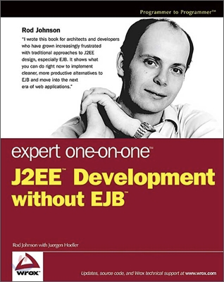

## EJB(Enterprise Java Bean)

컴퓨터와 인터넷이 발전하면서 기업에서 요구하는 IT 기술적 수준 또한 높아졌다. 그에 따라 `J2EE`가 나오고 `Servlet`과 `JSP` 등을 사용하게 되었지만 복잡한 엔터프라이즈 서비스를 개발하기에는 여전히 부족한 부분들이 많았다.

엔터프라이즈 서비스를 개발하면서 크게 2가지 어려움이 존재했다. 우선, 서비스가 성장함에 따라 비즈니스 로직 자체가 복잡해지기 시작했다. 그리고 빠르면서도 안정적이고 확장 가능한 서비스를 만들기 위해 필요한 로우 레벨의 기술들이 존재했다. 예를 들면 트랜잭션 처리나 동시성 문제, 리소스 풀링, 보안 등이 있다.

`Servlet`과 `JSP`를 사용해 이전보다는 비교적 편하게 Presentation 레이어를 구현할 수 있었다. 그러나 그 뒷단에서는 트랜잭션 관리를 하면서 사용자의 요청을 검증하고, 물건의 수량을 체크하면서 멀티 스레드 관리를 하는 코드가 존재할 수 밖에 없었다. 복잡해진 비즈니스 로직과 로우 레벨의 기술적인 구현이 합쳐지면서 점점 개발자가 코드를 작성하는데 부담을 느끼기 시작했고 이런 문제를 해결하기 위해 `EJB`가 등장했다.

> **EJB**는 애플리케이션 개발을 쉽게 만들어준다. 애플리케이션의 개발자는 로우레벨의 기술에 관심을 가질 필요가 없다.
>

`EJB`가 등장하면서 사람들은 `JSP`와 `Servlet`으로 Presentation 레이어를 구성하고 비즈니스로직은 `EJB`로 구현해나가기 시작했다. 덕분에 개발자들은 복잡한 트랜잭션 관리, SQL 작성 없이 비즈니스 로직 개발에 집중할 수 있었다.

또한 웹 애플리케이션을 개발하다 보면 많은 객체들을 만들고 사용하는 경우가 많은데 비즈니스 객체를 관리하는 **EJB 컨테이너**를 만들고 필요할 때 컨테이너에게 비즈니스 객체를 받아올 수 있었다.

실제로 `EJB`는 아래와 같은 기능을 개발자가 편리하게 사용할 수 있게 해주었다.

- 트랜잭션 관리
- 인증과 접근 제어
- EJB 인스턴스 풀링
- 세션 관리
- 데이터베이스 커넥션 풀링

하지만 `EJB`는 많은 문제점들을 가지고 있었다. `EJB`는 원래 분산 처리, 분산 트랜잭션을 보다 쉽게 사용하기 위해서 나온 기술이었다. 하지만 대부분의 웹 애플리케이션은 분산 처리 기능을 필요로 하지 않았다. 단지 로우 레벨의 기술 구현을 피하기 위해 멀티 DB 분산 트랜잭션을 지원하는 무거운 JAT 기반의 글로벌 트랜잭션 기능을 사용해야 했다. 또한 하나의 서버를 사용하는데도 `EJB`의 원격 분산 모델을 사용해 서버의 복잡도는 올라감에도 불구하고 성능은 떨어질 수 밖에 없었다.

결국 웹 애플리케이션이 `EJB`에 종속되기 시작했다. 항상 `EJB`의 수많은 요구사항들을 지켜야만 했다. 간단한 DAO를 구현할 때도 DAO의 비즈니스 로직보다 **EJB 컨테이너**들을 위한 코드들이 많아지기 시작했다.

이렇게 비즈니스 로직과 `EJB`가 섞인 비즈니스 객체들은 `EJB` 컨테이너 밖에서 정상적으로 동작하지 않았고 자동화된 테스트도 거의 불가능에 가까웠다. 개발자는 매번 수정-빌드-배포-테스트 사이클을 반복해야만 했다. 벤더사마다 EJB 컨테이너를 구현한 방식이 달라 이미 개발한 서버의 벤더를 변경하는 데도 어려움이 존재했다.

가장 큰 문제는 `EJB` 스펙을 따르는 비즈니스 클래스들은 객체지향 설계의 장점들을 포기해야만 했다. `EJB` 스펙을 준수하기 위해 수많은 클래스들을 상속받음에 따라 상속, 다형성의 이점을 누릴 수 없었고 간단한 기능 하나를 개발하기 위해서도 `EJB`에 의존적인 상속과 인터페이스 구현을 해야만 했다.

결국 개발자의 개발을 편하게 만들어주기 위해 나온 `EJB`가 오히려 개발자를 불편하게 만들고 생산성을 떨어트리게 만든 이유는 **비즈니스 로직이 특정 기술에 종속**되기 때문이다. 이를 **기술 침투**라고 한다.

## POJO

결국 EJB 컨테이너를 위한 수많은 상속과 기술 종속적인 코드로 인해 프레임워크에 종속된 **무거운** 객체를 만들게 된 것이 문제였다.

[마틴 파울러, 레베카 파슨스, 조시 맥켄지](https://www.martinfowler.com/bliki/POJO.html)는 2000년 9월에 열렸던 어느 컨퍼런스의 발표를 준비하면서 EJB 대신 단순한 자바 오브젝트에 비즈니스 로직을 구현하면 수많은 장점이 있는데 왜 사람들이 '평범한 자바 오브젝트'를 사용하기 꺼려하는지 의문을 가졌다. 마틴 파울러는 자바의 단순한 오브젝트에 EJB와 같은 그럴듯한 용어가 없기 때문에 사람들이 사용을 주저한다고 생각해 `POJO(Plain Old Java Object)`라는 용어를 만들었고 이 덕분에 많은 개발자들이 `EJB`에 반하는 `POJO`에 열광하게 되었다.

> 이로 인해 EJB 3.0에서는 `POJO`의 장점을 많이 도입하려 했다.
>

결국 `POJO(Plain Old Java Object)`란 특정 규약이나 환경, 기술, 그리고 프레임워크에 종속되지 않는 순수한 자바 클래스다. 즉, 아래와 같은 경우는 `POJO`가 아니다.

- 미리 정의된 클래스를 상속받는 경우

    ```java
    public class Foo extends javax.servlet.http.HttpServlet {
    ```

- 미리 정의된 인터페이스를 구현하는 경우

    ```java
    public class Bar implements javax.ejb.EntityBean {
    ```

- 미리 정의된 애노테이션을 포함하는 경우

    ```java
    @javax.persistence.Entity public class Baz
    ```


그러나 기술적 어려움 등으로 인해 많은 POJO 프레임워크들은 미리 정의된 애노테이션을 필요로 한다. 따라서 애노테이션이 있는 경우 순수한 POJO라고 할 수는 없다. 그러나 애노테이션은 그 자체만으로는 어떠한 기능도 하지 못하는 수동적인 메타데이터이므로 상속이나 인터페이스 구현 보다는 순수한 POJO에 가깝다.

그리고 단순히 애노테이션을 제거하는 것만으로도 POJO로 되돌릴 수 있기 때문에 애노테이션이 붙은 순수한 자바 객체는 POJO로 간주하는 경우가 많다.

## Spring

결국 `EJB`가 아니라 새로운 프레임워크가 나온다고 해도 `EJB`의 단점들을 답습할 수는 없기에 `POJO`로 비즈니스 로직을 구현했을 때의 장점과 `EJB`의 엔터프라이즈 기술을 모두 누릴 수 있는 **POJO 프레임워크**가 등장한다.



2002년 **로드 존슨**은 `EJB`의 문제점을 지적하면서 **Expert One-on-One: J2EE Development without EJB**라는 책을 선보였다. 고작 30,000 라인의 코드와 함께 스프링의 핵심 개념들과 기반을 제시했다.

책이 출간되자 마자 큰 인기를 끌었고 일부 개발자들은 이 책의 예제 코드를 자신의 프로젝트에 사용하기 시작했다. 책이 유명세를 탐에 따라 **유겐 휠러**와 **얀 카로프**는 **로드 존슨**에게 오픈소스 프로젝트를 제안했고 그렇게 스프링이 시작됐다.

## Spring의 특징

### 경량 컨테이너

`Spring`은 경량 컨테이너로서 자바 객체들을 관리해준다. 객체의 생성, 사용, 그리고 소멸과 같은 라이프사이클을 직접 관리해줌으로써 개발자가 직접 객체를 생성하고 관리하지 않아도 된다.

### POJO 기반의 프레임워크

`EJB`와 달리 `Spring`은 일반적으로 `Java` 코드를 이용해서 객체를 구성하는 방식을 그대로 사용할 수 있다. 즉, 다른 기술이나 프레임워크에 종속적이지 않은 객체를 작성할 수 있다. 그 덕분에 개발자는 자신이 필요한 비즈니스 로직에 어울리는 객체지향적인 설계를 할 수 있고 유연한 자동화 테스트를 할 수 있다.

즉, 프레임워크의 이점을 모두 누리면서도 프레임워크 없이 비즈니스 로직을 테스트할 수 있다. 그리고 `Java`의 객체지향적인 장점을 모두 누릴 수 있다. `POJO`가 가져다주는 장점을 모두 누릴 수 있는 프레임워크다.

### 제어의 역전(IoC: Inversion of Control) / 의존성 주입(DI: Dependency Injection)

`Spring`은 제어의 역전 지원하는 프레임워크다. 우리가 프레임워크의 API를 호출하는 것이 아니라 프레임워크가 적절한 때에 우리의 코드를 호출해준다. 예를 들어 사용자의 회원 가입 요청이 들어왔을 때 프레임워크는 우리의 회원가입 비즈니스 로직을 호출해준다.

우리는 `Spring`이라는 **IoC 경량 컨테이너**에게 우리의 제어권을 넘김으로써 객체의 라이프 사이클 관리, 흐름 제어를 위임시킬 수 있다. 덕분에 우리는 오로지 비즈니스 로직에 집중한 객체를 작성할 수 있다.

`Spring`은 `DI`를 이용해 의존성 역전을 통해 `IoC`를 달성한다. 만약 어떤 비즈니스 로직을 처리하기 위해서 다른 객체가 필요하다면 그 객체를 생성하는 대신 우리는 `Spring`에게 그 객체를 요청할 수 있다. 즉, 어떤 비즈니스 로직을 처리하기 위한 다른 객체의 **의존성을 주입**받을 수 있다.

덕분에 우리는 비즈니스 로직을 처리하기 위해 필요한 의존성들을 직접 관리할 필요가 없다. 수많은 의존성들을 생성하고, 사용하고, 소멸시키는 것대신 그저 요청하고 사용하는 것에만 집중할 수 있다.

그 외에도 `Spring`이 대신 의존성을 주입해주는 덕분에 우리는 전체 코드 수정 없이 의존성을 교체할 수 있다. 테스트 코드를 작성하면서를 MySQL 데이터베이스 의존성을 인메모리 데이터베이스로 교체하거나 인터페이스만 정의해놓으면 구현체를 주입받을 수도 있습니다.

### AOP(Aspect-Oriented Programming)

`Spring`은 로깅이나 보안, 그리고 트랜잭션 등 비즈니스 로직과는 관련이 없지만 여러 곳에 공통적으로 사용되는 기능들을 분리해서 개발하고 실행 시간에 조합해서 실행할 수 있는 **AOP(Aspect-Oriented Programming)**을 지원한다.

이 덕분에 우리는 여러 공통 기능을 재사용하면서 객체에 비즈니스 로직을 작성하는 데만 집중할 수 있다.

### PSA(Portable Service Abstraction)

`Spring`을 사용하면 특정 환경이나 서버, 특정 기술에 종속적이지 않고 이식성이 뛰어난 애플리케이션을 개발할 수 있다. 이를 가능하게 해주는 것이 바로 서비스 추상화다. 다르게 생각하면 기존 코드를 거의 변경하지 않고도 다른 기술 스택으로 전환할 수 있다.

예를 들어 트랜잭션 기능을 지원하기 위해 `@Transactional` 애노테이션을 사용한다고 했을 때 우리는 데이터베이스에 종속되지 않은 채로 트랜잭션 기능을 사용할 수 있다.

`MySQL`을 사용하다가 `PostgreSQL`을 사용하더라도 우리의 서비스 객체에 적용되었던 트랜잭션 기능을 수정할 필요가 없다. 이는 `Spring`의 서비스 추상화 덕분이다.

## Spring Boot

`Spring`은 이전에도 많이 사용되는 프레임워크였지만 `Spring boot`가 등장하고 난뒤 더욱 편하게 사용할 수 있는 강력한 프레임워크가 되었다. 공식 홈페이지에서 `Spring boot`를 어떻게 소개하고 있는지 확인해보자.

> Spring Boot makes it easy to create stand-alone, production-grade Spring based Applications that you can "just run".
We take an opinionated view of the Spring platform and third-party libraries so you can get started with minimum fuss. Most Spring Boot applications need minimal Spring configuration.

`Spring boot`는 즉시 단독으로 실행할 수 있는 프로덕션 수준의 스프링 애플리케이션을 쉽게 만들 수 있게 해줍니다.
우리는 Spring 플랫폼과 써드 파티 라이브러리에서 널리 쓰이는 설정들을 모아 제공하기 때문에 거의 불편함 없이 시작할 수 있습니다. 대부분의 `Spring Boot` 애플리케이션들은 최소한의 설정만을 필요로 합니다.
>

실제로 `Spring boot`는 공식 홈페이지에서 크게 6가지 기능을 이야기하고 있다. 그 중 중요한 내용들을 하나씩 알아보자

### 자동 설정(Auto Configuration)

이전에 `Spring`으로 웹 애플리케이션을 개발하기 위해 Transaction Manager, Hibernate Datasource, Entity Manager, Session Factory 등 수많은 설정을 끝내야만 그제서야 개발을 할 수 있었다. 여기서 또 새로운 라이브러리를 추가한다면 그에 맞는 수많은 설정들을 또 찾아서 설정해야만 개발을 이어나갈 수 있었다.

예를 들어 `Thymeleaf`를 사용하기로 결정했다면 아래와 같은 설정을 해줘야만 한다.

```java
@Configuration
public class ThymeleafViewResolverConfig {
    @Value("${thymeleaf.cache}")
    private boolean isCache;
    @Bean public SpringResourceTemplateResolver templateResolver() {
        SpringResourceTemplateResolver templateResolver = new SpringResourceTemplateResolver();
        templateResolver.setPrefix("classpath:templates/");
        templateResolver.setCharacterEncoding("UTF-8");
        templateResolver.setSuffix(".html");
        templateResolver.setTemplateMode("LEGACYHTML5");
        templateResolver.setCacheable(isCache);
        return templateResolver;
    }
    @Bean public SpringTemplateEngine templateEngine(MessageSource messageSource) {
        SpringTemplateEngine templateEngine = new SpringTemplateEngine();
        templateEngine.setTemplateResolver(templateResolver());
        templateEngine.setTemplateEngineMessageSource(messageSource);
        templateEngine.addDialect(layoutDialect());
        return templateEngine;
    }
    @Bean public LayoutDialect layoutDialect() {
        return new LayoutDialect();
    }
    @Bean @Autowired public ViewResolver viewResolver(MessageSource messageSource) {
        ThymeleafViewResolver viewResolver = new ThymeleafViewResolver();
        viewResolver.setTemplateEngine(templateEngine(messageSource));
        viewResolver.setCharacterEncoding("UTF-8");
        viewResolver.setOrder(0);
        return viewResolver;
    }
}
```

이러한 부담은 `Spring`을 잘 다루는 사람들에게도 큰 부담이었고 생산성을 크게 떨어트렸다.

`Spring Boot`는 `Auto-configuration` 기능을 사용하면 우리가 어떤 클래스, 라이브러리를 사용하는지 분석해 필요한 `Bean`을 등록하고 필수적인 설정을 해준다.

예를 들어 `Thymeleaf`를 사용한다면 아래 한 줄만 추가해주면 된다.

```java
implementation 'org.springframework.boot:spring-boot-starter-thymeleaf'
```

이 덕분에 기존에 개발자가 하나하나 `bean`을 등록하고 설정할 필요가 없어졌다.

### Starter 모듈을 통한 의존성 관리

`Jackson`을 사용하는 `Spring MVC` 애플리케이션을 개발하기 위해서는 최소한 아래 의존성이 필요하다.

- spring-core
- spring-web
- spring-webmvc
- jackson-databind
- tomcat-embed-core
- tomcat-embed-el
- tomcat-embed-logging-juil

단순히 이런 의존성을 추가하는 것은 물론이고 각 모듈의 어떤 버전이 서로 호환되는 지도 신경써야 한다.

그 대신, `spring-boot-starter-web` 모듈 하나만 추가하면 종속성이나 호환성 걱정 없이 필요한 모든 모듈을 사용할 수 있다.

만약 `JPA`를 사용한다면 `spring-boot-starter-data-jpa`를 추가하면 된다.

즉, `spring-boot`에서 특정 목적에 필요한 의존성들을 `starter` 모듈로 모아놓음으로써 편하게 의존성 관리를 할 수 있다.

### io.spring.dependency-management

만약 우리가 `Spring`과 다른 써드파티 모듈을 사용하는 경우 이 모듈이 우리의 `Spring`과 호환되는지 확인해야 한다. 그리고 `Spring`의 버전을 올리거나 써드파티 모듈의 버전을 올릴 때 호환성 문제가 없는지 매번 확인해야 한다.

그러나 `build.gradle`에 `apply plugin: 'io.spring.dependency-management'` 한 줄만 적용해주면 우리가 모듈의 버전 관리를 해줄 필요가 없다. `io.spring.dependency-management` 플러그인이 `Spring Boot`에 맞는 모듈 버전을 알아서 설정해준다.

이렇게 설정된 버전은 `Spring`을 관리하는 개발자들이 먼저 테스트를 한 뒤에 설정한 버전이기 때문에 우리는 호환성 걱정을 할 필요가 없다.

그리고 `Spring`이나 `Spring Boot`의 버전을 올리는 경우에도 그에 맞게 써드파티 모듈의 버전도 호환되는 버전으로 올려준다.

### 내장 톰캣

기존에는 `Spring` 프로젝트를 `WAR`로 빌드하고 이를 `Tomcat`과 같은 `WAS`에 배포해야만 했다. 즉, `Spring` 프로젝트를 독립적으로 실행할 수 없었다.

그러나 `Spring Boot`는 `Tomcat`이나 `Jetty`, `Undertow` 등을 내장함으로써 독립적으로 실행 가능한 `JAR` 파일로 배포할 수 있다.

### Spring Boot Actuator

`spring-boot-starter-actuator` 의존성을 추가하기만 하면 HTTP 엔드포인트나 `JMX`를 사용해서 현재 애플리케이션의 상태를 모니터링 할 수 있다.

Applicaiton Context에 구성되어 있는 Bean을 확인하거나 최근 HTTP 요청, CPU나 메모리 상태, 가비지 콜렉션, 현재 환경 변수 등을 확인할 수 있다. 구체적으로 어떤 내용을 확인할 수 있는 지는 [공식 문서](https://docs.spring.io/spring-boot/docs/2.1.8.RELEASE/reference/html/production-ready-endpoints.html#production-ready-endpoints-enabling-endpoints)에서 확인할 수 있다.

또한 커스텀한 값들을 `Actuator`를 통해서 커스텀 엔드포인트를 구성해 제공할 수도 있다.

덕분에 단순히 의존성을 추가하는 것만으로도 애플리케이션을 모니터링할 수 있다.

```toc
```
